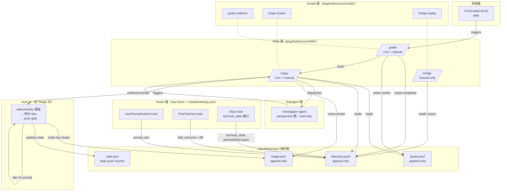
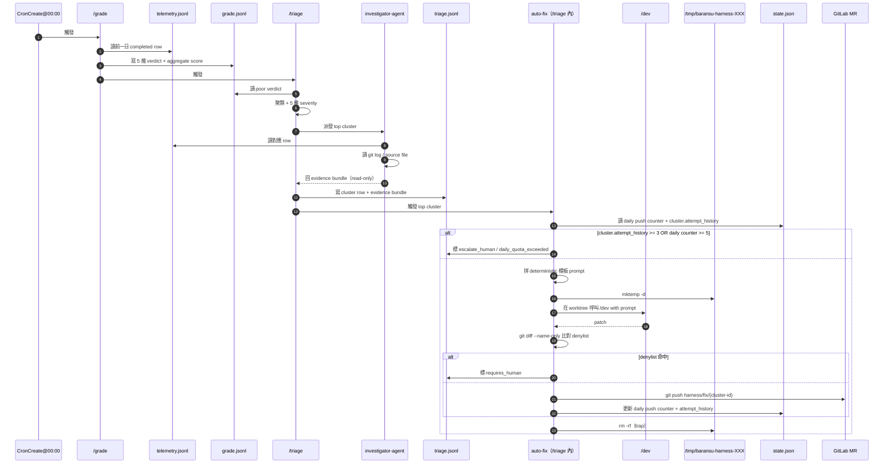
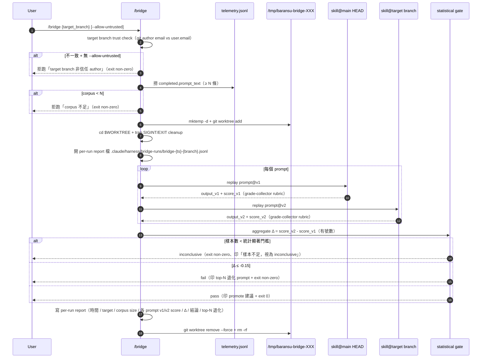

# Design

## 系統架構

七層元件，由內向外：



虛線（`-.-`）= script 是 skill 的執行載體（skill 描述邏輯，script 跑實作）。

### 元件職責

| 元件 | 職責 | 不做 |
|------|------|------|
| UserPromptSubmit hook | 在 user 送出 prompt 那一刻寫 `session_id` + `prompt_text` 到 telemetry.jsonl | 不參與評分、不讀其他層 |
| PostToolUse hook | skill 跑完後寫 `skill_outcome` + `commit_hash` + `diff_summary_redacted` + 更新 `terminal_state == completed`（正常結束） | 不寫 prompt（已由 UserPromptSubmit 寫） |
| Stop hook | session 結束時若對應 row 仍是 `in_progress`，補刀標 `aborted`（user ctrl-c）或 `interrupted`（系統異常終止）| 不參與評分、不寫 diff 摘要 |
| /grade | 對 completed telemetry row 按 5 維 baransu-native equal-weight (1/5) rubric 打分 → grade.jsonl；累積 ≥ 50 條 completed row 時 stdout 印 `tune_review_due: true`，並把 ISO 時間寫入 state.json `tune_review_due_since` | 不聚類（交給 /triage）、不接 LLM judge、權重不寫死於 script（rubric 公式須 deterministic 可重現） |
| /triage | grade.jsonl 聚類 + 5 維 severity → top cluster → 派 investigator → 觸發 auto-fix | 不打分（交給 /grade）、不直接修 code |
| /bridge | 從 telemetry.jsonl 撈 corpus，在 isolated worktree 跑 v1 vs v2 head-to-head；全程 cwd 設在 worktree dir（mktemp），不在主 repo；輸出 stdout 報表 + statistical gate exit code + 寫 per-run report 到 `.claude/harness/bridge-runs/bridge-{ts}-{branch}.jsonl`（單 writer、檔名隔離、無 race）。Stage 0 跑 target branch trust check 防 RCE | 不接 LLM judge（純 score 比對；score 由 grade-collector 同一份 rubric script 計算，無 LLM 路徑）、不 touch 主 repo working tree、不寫 telemetry / grade / triage 三 jsonl |
| investigator-agent | 讀 git log + telemetry row + source file，產 evidence bundle | 不寫任何檔（perspective 類 read-only）、無 git ops |
| grade-collector / triage-cluster / bridge-replay | skill SKILL.md 描述邏輯，script 是執行載體（語言依實作選 shell/python） | — |

## 整體操作流程

### 流程 1：每日 cron 自癒迴圈



### 流程 2：手動 /bridge head-to-head replay



## 整體資料流

```mermaid
flowchart LR
  subgraph capture["資料擷取"]
    UPS[UserPromptSubmit] -->|prompt_text| TJ
    PTU[PostToolUse] -->|outcome + diff| TJ
  end

  subgraph eval["評估"]
    TJ[telemetry.jsonl] --> G[/grade]
    G --> GJ[grade.jsonl]
  end

  subgraph triage["分流"]
    GJ --> T[/triage]
    TJ --> T
    T --> RJ[triage.jsonl]
  end

  subgraph fix["修補"]
    RJ --> AF[auto-fix]
    AF --> ST[state.json]
    AF --> MR[GitLab MR]
  end

  subgraph bridge["守門"]
    TJ -.corpus.-> B[/bridge]
    B --> GATE[statistical gate]
    GATE -.stdout.-> USR[user terminal]
  end
```

無 cycle：auto-fix 失敗只更新 telemetry 對應 row 的 `attempt_history` + state.json daily counter，不 push；下一輪 /triage 讀同 cluster_id 的 attempt_history 跳過。/bridge 結果只寫 stdout 報表 + exit code，不寫任何 jsonl 副檔（避免 cron 與手動觸發共寫造成 race condition）。

## 資料模型

### telemetry.jsonl（每行一個 JSON object）

| 欄位 | 型別 | 寫入者 | 範例 |
|------|------|--------|------|
| `session_id` | string | UserPromptSubmit | `s-2026-04-28-001` |
| `terminal_state` | enum: `completed`/`aborted`/`interrupted` | PostToolUse（最終）/ Stop hook fallback | `completed` |
| `prompt_text` | string | UserPromptSubmit | `「重構 auth 模組」` |
| `skill_outcome` | object: `{skill_name, final_state, exit_code}` | PostToolUse | `{"skill_name":"think","final_state":"approved","exit_code":0}` |
| `commit_hash` | string (40 hex) | PostToolUse | `3a525e5...` |
| `diff_summary_redacted` | array of `{path, plus, minus}` | PostToolUse | `[{"path":"src/main.py","plus":12,"minus":3}]` |
| `attempt_history` | array of `{cluster_id, run_at, result}` | auto-fix（cluster-keyed update，**唯一 hook 以外的 telemetry 寫入路徑**） | `[{"cluster_id":"cl-001","run_at":"2026-04-28T00:05","result":"fail"}]` |

> **Append-only 與 attempt_history 的契約**：rows 由 hook 以 append-only 方式寫入；`attempt_history` 是 auto-fix 對既有 row 唯一允許的 mutation，採 cluster_id 作為 join key 反向更新對應 row（不是新增 event row）。triage.jsonl 的 `attempt_count` 是這份 attempt_history 的衍生 aggregate（read-only view），**權威來源在 telemetry**。auto-fix 以外的元件不得寫 telemetry。

### grade.jsonl（每行一個 verdict）

| 欄位 | 型別 |
|------|------|
| `session_id` | string（對應 telemetry） |
| `dims` | object: `{outcome_quality, iteration_velocity, scope_blast, human_override_rate, failure_recurrence}` 各 0-1 浮點 |
| `aggregate` | float（5 維 equal-weight 平均；每維 1/5） |
| `quality` | enum: `excellent`/`good`/`acceptable`/`poor` |
| `weights` | object（記錄當下用的權重，便於 tune 後 re-grade 對照） |

### triage.jsonl（每行一個 cluster）

| 欄位 | 型別 |
|------|------|
| `cluster_id` | string（穩定 ID，例如 `cl-001`） |
| `member_session_ids` | array of string |
| `severity_dims` | object（5 維 severity，與 grade dims 同名同結構） |
| `severity_aggregate` | float |
| `escalate` | enum: `false`/`requires_human`/`daily_quota_exceeded` |
| `evidence_bundle` | object: `{root_cause_guess, citations[]}`（由 investigator 寫入） |
| `attempt_count` | int（同 cluster_id 跨 run 累計失敗次數；衍生欄位，從 telemetry 的 `attempt_history` 計算） |

### state.json（單一 JSON object）

| 欄位 | 型別 | 用途 |
|------|------|------|
| `daily_push_count` | int | 當日已 push 數 |
| `daily_push_date` | ISO date | 用於辨識是否需要 reset |
| `last_grade_run_at` | ISO datetime | 觀測用 |
| `last_triage_run_at` | ISO datetime | 觀測用 |
| `tune_review_due_since` | ISO datetime / null | /grade 累積 ≥ 50 條 completed row 後寫入；user 跑 `/grade --tune-acknowledged` 後清回 null |
| `cumulative_completed_count` | int | /grade 跑完更新；用來判斷是否觸發 `tune_review_due` 旗標 |

## 錯誤處理策略

| 層 | 錯誤情境 | 處理 | 對使用者呈現 |
|----|---------|------|-------------|
| hook | hook 自身 crash | hook stderr → `~/.claude/logs/`（如有），skill 仍正常完成 | 透明，不打擾 |
| hook | 寫 telemetry.jsonl I/O fail（disk full / permission） | 該次寫入丟失（next round 會繼續）；hook 不阻擋 skill 主流程 | 透明（看 log 才知） |
| /grade | 讀 telemetry.jsonl 解析錯（壞行） | skip 該行 + log warning；其他行繼續 | next-day 看 log |
| /grade | rubric 計算 NaN | 該 row verdict 標 `dims_calc_failed`，aggregate=null，不阻擋整體 | grade.jsonl 留錯誤紀錄 |
| /triage | grade.jsonl 為空 | /triage 跳過 + log info | 透明 |
| /triage | investigator agent 派發失敗 | 該 cluster 標 `investigator_failed`，跳過 auto-fix | triage.jsonl 留紀錄 |
| auto-fix | denylist 命中 | abort 該 cluster + 標 `requires_human` | 寫進 triage.jsonl，下一輪 /triage 跳過 |
| auto-fix | attempt cap 命中 | abort + 標 `escalate_human` | 同上 |
| auto-fix | daily quota 命中 | abort + 標 `daily_quota_exceeded` | 同上，隔日 reset |
| auto-fix | /dev 呼叫失敗 | attempt_history 加 fail row + 不 push | 下一輪 /triage 看 attempt 累計 |
| auto-fix | git push 失敗（網路 / GitLab 503） | attempt_history 加 fail row + 不刷 daily counter | 同上 |
| /bridge | telemetry corpus < N 條 | 拒絕跑 + 印「corpus 不足」 | user 終端訊息 |
| /bridge | git worktree create fail | trap 啟動 + 印明確錯誤 | user 終端訊息 |
| /bridge | replay 中 SIGINT | trap → `git worktree remove --force` + `rm -rf` | user 看到 cleanup 訊息 |
| /bridge | statistical 結果無法成立（樣本太少） | 印「樣本不足，視為 inconclusive」 | user 看到判讀 |

## Hard Constraint 投影表（KD#1 ~ KD#6）

| KD | 子規則 | Design 投影位置 |
|----|-------|----------------|
| **#1 三件式必 ship + investigator** | /grade /triage /bridge 三 skill 各自獨立 user-facing | 系統架構 mermaid `skills_layer` 三 box；元件職責表 3 列；流程 1 + 流程 2 SeqDiag |
| #1 | investigator-agent 屬 perspective 類，read-only 無 git ops | 系統架構 `subagent_layer`；元件職責表「不寫任何檔、無 git ops」；資料流圖 SUB→ST 只回 evidence bundle |
| **#2 兩個 hook + Stop fallback、user-level 註冊** | UserPromptSubmit + PostToolUse + Stop hook 三件 | 系統架構 `hooks_layer` 三 box；元件職責表 3 列；資料流圖 capture subgraph |
| #2 | 不進 plugin.json hooks 欄位 | 系統架構 subgraph 標題明寫 `user-level ~/.claude/settings.json`；KD #2 由 task-hooks-04 + invariants 檢查腳本守門 |
| **#3 telemetry 7 欄位 + completed 過濾 + corpus 來源** | 7 欄位齊全 | telemetry.jsonl schema 表 7 列 |
| #3 | /grade 只看 completed | /grade 元件職責；流程 1 SeqDiag「讀前一日 completed row」 |
| #3 | Bridge corpus 來自 completed.prompt_text | 流程 2 SeqDiag「撈 completed.prompt_text」步；資料流圖 `TJ -.corpus.-> B` |
| **#4 rubric equal-weight bootstrap + 50 條 trigger** | 5 維 baransu-native 1/5 each | /grade 元件職責「按 5 維 baransu-native equal-weight (1/5) rubric」；grade.jsonl `weights` 欄位 |
| #4 | tune trigger ≥ 50 條 completed | /grade 元件職責「累積 ≥ 50 條 completed row 時 stdout 印 `tune_review_due: true`」；state.json `cumulative_completed_count` + `tune_review_due_since` 欄位 |
| **#5 auto-fix 安全邊界 5 條** | fix prompt deterministic 模板 | auto-fix 元件描述、流程 1 SeqDiag「拼 deterministic 模板 prompt」步；下方「Deterministic 模板 invariants」段 |
| #5 | hook redaction filter | PostToolUse 元件職責表 + telemetry schema `diff_summary_redacted` 命名 |
| #5 | `.gitignore` 含 `.claude/harness/` | 儲存層位置（pre-condition；責任 owner = task-shared-03） |
| #5 | push denylist | 流程 1 SeqDiag「git diff --name-only 比對 denylist」步；錯誤處理表 |
| #5 | attempt cap K=3 + daily quota=5 | state.json schema + 流程 1 SeqDiag「讀 daily push counter + cluster.attempt_history」步 |
| **#6 隔離保證** | /bridge 用 mktemp 在 repo 外 + cd $WORKTREE | 流程 2 SeqDiag「mktemp -d」+「cd $WORKTREE」步 |
| #6 | auto-fix 用 mktemp 在 repo 外 | 流程 1 SeqDiag「mktemp -d」步 |
| #6 | trap SIGINT/EXIT | 流程 1 + 流程 2 SeqDiag「trap」步 |
| #6 | auto-fix 永不 touch 主 repo working tree | 元件職責表 + 流程 1 SeqDiag 全程操作均在 worktree。註：「主 repo working tree」= git index 與 git-tracked 工作區；`.claude/harness/` 雖位於 repo 內但已 gitignore，視為 harness-owned scratch space，auto-fix 對其 mutation 不違反此 KD |

## Telemetry mutation contract

`telemetry.jsonl` 是事件 + 跨 run 狀態的混合 store；為避免「append-only」假設與「auto-fix 反向 mutation」實作矛盾，本節是權威契約。所有元件必須遵守。

### Writer 名單（4 個）

| Writer | 觸發時機 | 可動欄位白名單 | 操作型態 |
|--------|---------|--------------|---------|
| UserPromptSubmit hook | user 送出 prompt | `session_id` / `prompt_text`（已 redact）/ `terminal_state=in_progress`（初值）/ `attempt_history=[]`（初值） | append 新 row |
| PostToolUse hook | skill 完成 final tool 後 | `skill_outcome` / `commit_hash` / `diff_summary_redacted`（已 redact）/ `terminal_state=completed`（CAS guard：只在 in_progress 才升） | merge into existing row（用 session_id locate） |
| Stop hook | session end 時對應 row 仍 `in_progress` | `terminal_state=aborted` | merge into existing row（CAS guard：只在 in_progress 才轉 aborted） |
| auto-fix（在 isolated worktree 跑）| /triage 觸發 | `attempt_history`（append element） | merge into existing row（用 session_id+cluster_id locate；append element 進 array，**不**新增 jsonl 行）|

> 額外：`grade-collector` 跑 staleness reaper 可能改 `terminal_state=interrupted`（超過 24h 仍 in_progress 的 row）。為避免污染 /grade 職責，把 staleness reaper 拆成獨立 script `harness-reaper.{sh|py}`，由 /grade Stage 0 呼叫；reaper 只能改 `terminal_state` from `in_progress` 為 `interrupted`。

### Terminal_state 單調轉移規則

只允許下列方向轉移，**不可往左退**：

```
in_progress  ──(PostToolUse)──▶  completed  (final 不可變)
in_progress  ──(Stop hook)─────▶  aborted     (final 不可變)
in_progress  ──(reaper 24h)────▶  interrupted (final 不可變)
```

任何 writer 在寫 `terminal_state` 前必須先 read 當前值，**只在當前 == in_progress** 才允許更新（CAS guard）。Q-F1 ordering B（Stop 先觸發、PostToolUse 後到）就由 PostToolUse 的 CAS guard 阻擋：當 row 已是 `aborted`，PostToolUse 只能 merge 非 state 欄位（commit_hash / diff / outcome），不可改 terminal_state。

### 並發保護

- 4 個 writer 對同一檔可能並發。所有寫入路徑必須持 `flock(2)` 鎖 `.claude/harness/.telemetry.lock`。
- jsonl row 內變更（hook merge、auto-fix append element）必須走 atomic：read 全檔 → modify in-memory → 臨時檔 → atomic rename。對純 append（UserPromptSubmit）也持 lock 保險。
- INT-1 / INT-2 必須在並發測試（並行 fork 100 個 hook）下仍維持「同 session_id 唯一一條 row」。

### attempt_history 子契約

- auto-fix 是「對既有 row 做 mutation」唯一的 hook 以外 writer。
- mutation 形式 = 在對應 row 的 `attempt_history` array 裡 append 一個 `{cluster_id, run_at, result}` element（不新增 jsonl 行；用 session_id+cluster_id locate）。
- triage.jsonl 的 `attempt_count` 是這份 attempt_history 的衍生 aggregate（read-only view）；權威來源永遠在 telemetry。
- auto-fix 寫入時走 worktree（KD#6）但目標檔 `.claude/harness/telemetry.jsonl` 是 harness-owned scratch（已 gitignore），不算 touch 主 repo working tree。

---

## /bridge per-run report storage

修正先前「stdout-only」過頭設計：A-F2 指出 R3 demo 抓到 regression 後沒法稽核（哪個 commit / Δ 多少 / corpus 哪些）。引入 per-run report 檔（單 writer、檔名隔離，不會 race）：

- 路徑：`.claude/harness/bridge-runs/bridge-{ISO_ts}-{branch_or_cluster}.jsonl`
- 每次 /bridge invocation 新建一個 jsonl 檔（單 writer 自寫自關，不共寫）
- 內容：起始時間 / target branch / corpus size / 每筆 prompt 的 v1/v2 score / 最終 Δ / pass/fail/inconclusive 結果 / 影響最大 top-N prompt 摘要
- 由 `.gitignore` 覆蓋（`.claude/harness/` 整個目錄已 ignore）
- INV-5 不變（per-run 檔位於 harness scratch，非主 repo working tree）

### /bridge target branch trust check（S-F3 防 RCE）

`/bridge` 執行 v2 SKILL body 等於本機跑 attacker-controlled code。Stage 0 加 trust check：

1. 讀 target branch 的 commit author email
2. 比對 `git config user.email`
3. 不一致 → 預設拒跑，要求 `--allow-untrusted` flag 才綠燈
4. SKILL.md doc 警語：「v2 SKILL body 會以你的身分本機執行；只對自己信任的 branch 用 /bridge，否則加 `--allow-untrusted` 並承擔 RCE 風險」
5. 長期解：firejail / bwrap sandbox 留 v2，本期僅做語意層擋

---

## Deterministic 模板 invariants

auto-fix 拼 fix prompt 必須符合下列三條 invariants（rubric 計分公式同樣適用，因為 /bridge 仰賴 grade-collector 一份 rubric）：

1. **無時間戳/隨機欄位**：模板與其輸入欄位禁含 `now()`、`uuid`、`random_seed`、`__hash__` 等非 deterministic 來源；time-based 欄位若必要則改用 cluster_id 或 commit_hash 取代。
2. **欄位排序固定**：top-N evidence 條目按既定順序（建議：`severity desc, file_path asc, line asc`），不依 dict insertion order。
3. **byte-for-byte reproducibility**：相同 cluster_id + 相同 evidence bundle 兩次 invocation 產出的 prompt 與 score 都應 hash 相同（INT-12 / INT-10 對應）。

這三條同時也是 INT-10、INT-12、INV-4 的 design-level 落腳點。
