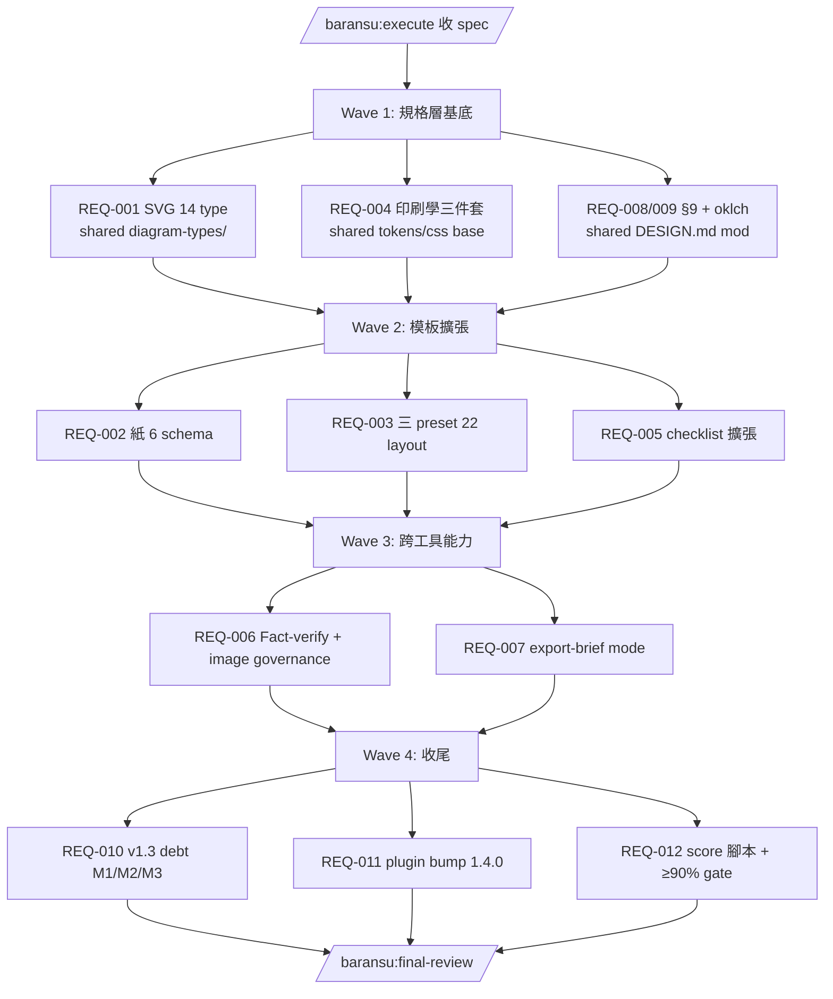
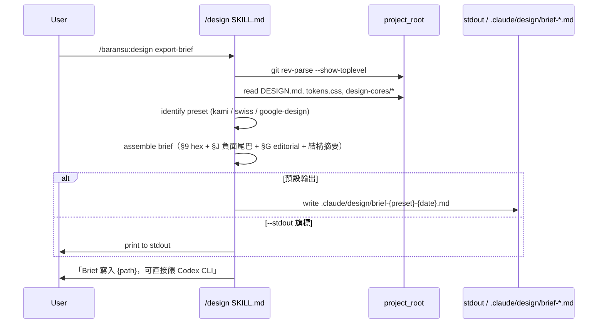
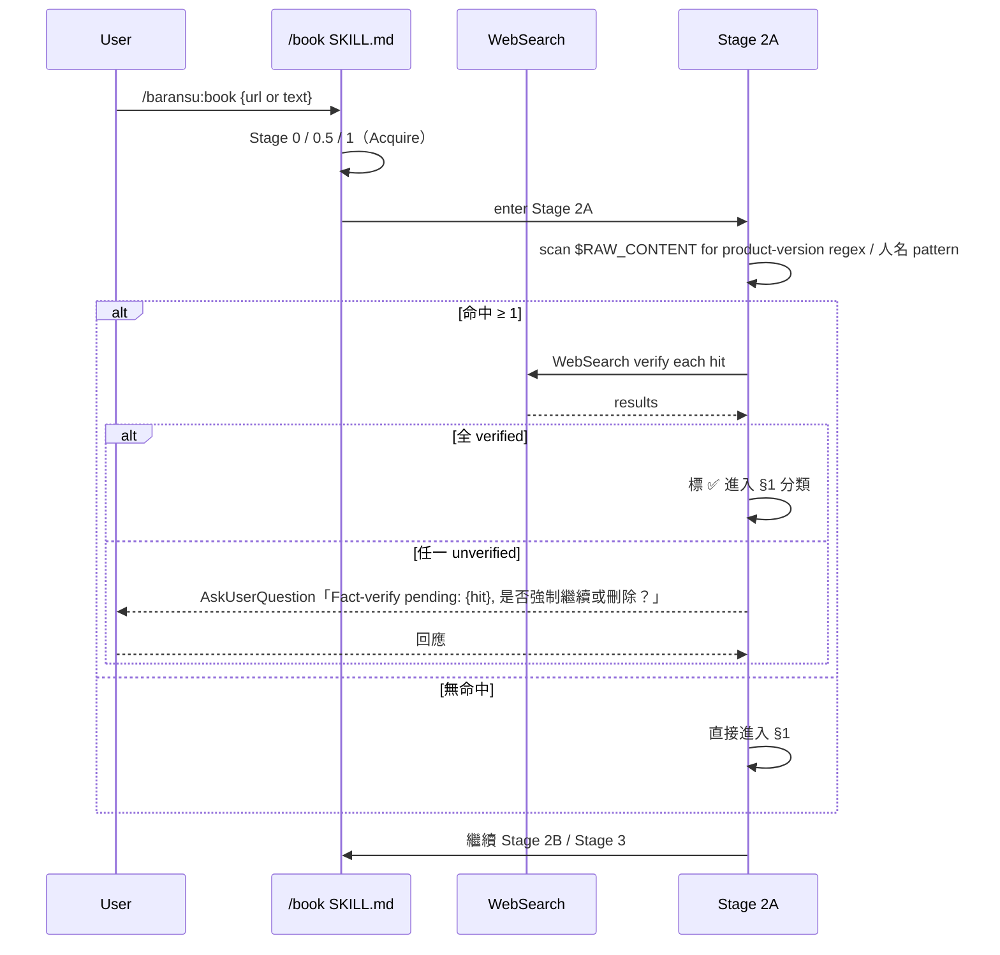
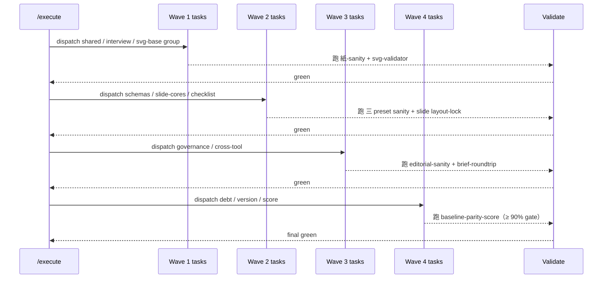

# Design

> 本 spec 動的不是「app」而是 baransu plugin 的 skill 集（純文檔 + script），故系統架構著重於檔案層級職責、跨 skill 流動、與三 preset 一致性。沒有真正的 backend/frontend；「資料模型」改為「規格資料 schema」；「API sequence」改為「skill 子模式 invocation flow」。

---

## 系統架構

baransu plugin 的 design + book 兩 skill 從「**規格層**」（spec markdown）+「**模板層**」（design-cores HTML + tokens.css）+「**驗證層**」（sanity.sh / check.py / validate-output.ts）三層組成。本次 v1.4 動的元件：

```
plugins/baransu/
├── .claude-plugin/plugin.json                  # version 1.3.1 → 1.4.0（REQ-011）
├── skills/
│   ├── book/
│   │   ├── SKILL.md                            # Stage 2A §0 加 Fact-Verify Principle（REQ-006）
│   │   │                                       # Stage 3 §4 chevron / 節點寬 spec 對齊（已 v1.3.1 完成）
│   │   │                                       # Stage 整數化（REQ-010 / M3）
│   │   ├── references/
│   │   │   ├── svg-rendering-rules.md          # 已 v1.3.1 對齊 Kami spec（前置完成）
│   │   │   ├── diagram-types/                  # 13 個 type-*.md → 升級 status=complete（REQ-001 主軸）
│   │   │   ├── design-token-resolver.md        # M2：v1.3-aware 升級（REQ-010）
│   │   │   ├── golden-template.html            # M2：三 preset 解析示例擴張（REQ-010）
│   │   │   └── image-prompts.md                # 新增（REQ-006）
│   │   └── scripts/
│   │       ├── validate-output.ts              # 加 GATE-H editorial / GATE-I export-brief（REQ-004 / REQ-007）
│   │       ├── validate-swiss-deck.mjs         # 新增（REQ-003）
│   │       └── swiss-smoke-test.sh             # M1：22 layout fixture regen（REQ-010）
│   └── design/
│       ├── SKILL.md                            # 新增 Export-brief mode（REQ-007）
│       │                                       # Stage 整數化（REQ-010 / M3）
│       └── references/
│           ├── slide-checklist.md              # 5 → 15-20 條 P0-P3（REQ-005）
│           ├── canonical-tokens.md             # 加 perfect fourth scale 註解（REQ-003）
│           ├── 紙-preset/
│           │   ├── DESIGN.md                   # §9 三要素 + §2 oklch footnote（REQ-008 / REQ-009）
│           │   ├── tokens.css                  # 1.333 modular scale（REQ-003）
│           │   ├── design-cores/               # 加 dropcap + text-wrap pretty + curly（REQ-004）
│           │   ├── slide-cores/                # 12 → 22 layout（REQ-003）
│           │   ├── schemas/                    # 新增 6 個 schema（REQ-002）
│           │   ├── image-prompts.md            # 新增（REQ-006）
│           │   └── 紙-sanity.sh                # 加 editorial / object-position lint（REQ-002 / REQ-004）
│           ├── swiss-preset/                   # 同等於紙 preset 的 mirror 結構（同 REQ-002/003/004/006/008/009）
│           └── google-design-preset/           # 同上
└── scripts/                                    # plugin-level scripts（新層）
    └── baseline-parity-score.py                # 自評腳本（REQ-012）
```

**三層職責**：
- **規格層**（markdown）：定義「應該長什麼樣」；agent / 用戶 / 外部工具的 source-of-truth
- **模板層**（HTML / CSS / 圖）：規格的可運行 reference；/book Stage 3 直接消費
- **驗證層**（shell / py / ts）：規格與模板的合規 gate，CI-runnable 機械判定

---

## 整體操作流程

從用戶觸發到 v1.4 milestone 完成的高階流程：



依賴方向：規格 → 模板 → 跨工具 → 收尾。每一波結束跑 sanity / smoke-test 確認 green，再開下一波。

---

## 畫面關聯（不適用）

本 spec 不動產品 UI。三 preset DESIGN.html 的視覺改動由 REQ-004 / REQ-008 / REQ-009 「就地」更新，無新增 page。

---

## API Sequence（改：Skill 子模式 invocation flow）

### Flow 1：`/baransu:design export-brief`（REQ-007 主軸）



### Flow 2：`/baransu:book` 對含產品 / 版本字串長文（REQ-006 主軸）



### Flow 3：`/baransu:execute` 跑本 spec 的 task chain



---

## 整體資料流

```mermaid
flowchart LR
  DESIGN[DESIGN.md per preset] --> Tokens[tokens.css per preset]
  DESIGN --> Schemas[schemas/*.md per preset]
  Tokens --> Cores[design-cores / slide-cores HTML]
  Schemas --> Cores
  Cores --> SlideCores[slide-cores 22 layout]
  Cores --> Sanity[紙/swiss/gd-sanity.sh]
  Schemas --> Sanity
  SlideCores --> ValidateSwiss[validate-swiss-deck.mjs]
  DESIGN --> §9[§9 AI Prompt Guide]
  §9 --> Brief[/design export-brief output]
  Brief --> Codex[Codex CLI / ChatGPT Images 2.0 端]

  Cores --> Book[/book Stage 3 render]
  Book --> Output[long-form / ppt HTML]
  Output --> Validate[validate-output.ts GATE A-K]

  Validate --> Score[baseline-parity-score.py]
  Sanity --> Score
  ValidateSwiss --> Score
  Score --> Final[Overall % vs 90% gate]
```

---

## 資料模型（規格 schema）

### Diagram-type schema（REQ-001 主軸）

每個 `book/references/diagram-types/type-{name}.md` 規格化為：

| 欄位 | 型別 | 必填 | 說明 |
|------|------|------|------|
| `status` | `complete \| ref-only` | ✓ | v1.4 目標：13 個 type 全為 complete |
| `type` | string | ✓ | 圖表類型名（snake_case，如 `architecture`） |
| `best-for` | string[] | ✓ | 適用資料形狀的 5-8 種具體場景 |
| `example-svg` | inline SVG block | complete 時必填 | 完整 chevron defs + paper-mask + ≥ 1 focal 節點 |
| `routing-keywords` | string[] | ✓ | Stage 3 §4 §4.9 決策樹用 |
| `min-viewBox` / `max-viewBox` | string | optional | 推薦尺寸範圍 |
| `node-width-tier-policy` | enum | ✓ | `3-tier` / `2-tier (viewBox<360)` |

### Document-schema（REQ-002 主軸）

新增 `紙-preset/schemas/{name}.md`：

| 欄位 | 型別 | 必填 | 說明 |
|------|------|------|------|
| `schema-id` | enum | ✓ | `resume` / `portfolio` / `one-pager` / `letter` / `equity-report` / `changelog` |
| `class-prefix` | string | ✓ | 一律 `kami-` |
| `langs` | string[] | ✓ | `["zh", "en"]` |
| `body-sections` | string[] | ✓ | 必填章節清單 |
| `image-requirements` | object | optional | 若含人像 → `object-position: center 35%` 強制 |
| `editorial-requirements` | object | ✓ | dropcap-line-count / curly-quotes / widow-orphan 三 flag |

### Checklist entry（REQ-005 主軸）

| 欄位 | 型別 | 必填 | 說明 |
|------|------|------|------|
| `id` | string | ✓ | `P0-S-01`（Swiss 專屬）/ `P0-A-02`（all preset 通用）/ `P0-B-01`（baransu plugin 自身規範，如 plugin.json / SKILL.md 紀律）/ `P1-03` / `P2-04` / `P3-05` 等 |
| `priority` | enum | ✓ | `P0 \| P1 \| P2 \| P3` |
| `現象` | string | ✓ | ≥ 10 字 |
| `根因` | string | ✓ | ≥ 10 字 |
| `做法` | string | ✓ | ≥ 10 字，含具體 CSS / SKILL.md 修改點 |
| `source` | string | ✓ | `dogfood-{deck-name}` / `huashu-incident-{date}` / `kami-spec-L{line}` |

### Score record（REQ-012 主軸）

`baseline-parity-score.py` 內部資料結構：

```python
@dataclass
class CriterionResult:
    id: str            # "C1" ... "C11"
    weight: float      # 加權，總和 = 1.0；C1/C3 各 0.15，其他 0.07-0.10
    pass_: bool
    detail: str        # 具體 fail 段（若 fail）
    sub_checks: list[tuple[str, bool]]  # 例：C1 含 14 個 sub-check（每 diagram type 一個）
```

---

## 錯誤處理策略

| 層 | 錯誤類型 | 處理方式 |
|----|---------|---------|
| **規格層** | DESIGN.md / schema 缺欄位 | `紙-sanity.sh` / `swiss-sanity.sh` 報具體缺項；exit 1，不執行下游 |
| **模板層** | design-cores HTML class prefix 混用 | sanity script `#33 slide-class-prefix` 報行號；exit 1 |
| **模板層** | SVG 不合規（節點寬 / chevron / 4-multiple） | `validate-output.ts` GATE-A-G 報具體節點；exit 1 |
| **模板層** | dropcap 行高不符 / curly quote 缺漏 / text-wrap pretty 缺漏 | `validate-output.ts` GATE-H editorial-sanity 報具體 selector；exit 1 |
| **模板層** | export-brief 產出 brief 缺五段之一 | `validate-output.ts` GATE-I export-brief-presence 報缺段；exit 1 |
| **規格層** | image-prompts.md prompt 結尾缺負面尾巴（`no title, no footer, no page chrome, no logo, no border`） | 三 preset sanity.sh 對 image-prompts.md grep 負面尾巴；缺字串即 exit 1 |
| **規格層** | Core Asset Protocol 4 步流程跳步（ask → generate/search → verify → freeze） | SKILL.md 文檔規範；違規由 user / review-agent 人工發現，無 mechanical gate（因為走運行時人類流程） |
| **驗證層** | swiss-smoke-test fixture stale（新 layout / schema 已加但 fixture 缺對應） | swiss-smoke-test.sh 報具體不匹配 fixture path；建議用戶 regen，**不自動 regen**；對應 B23 / B28 |
| **跨工具層** | export-brief 找不到 project root | fallback 到 cwd；stderr warning「未找到 git root，使用 cwd」 |
| **跨工具層** | Fact-verify WebSearch 失敗 / 超時 | `AskUserQuestion`：強制繼續 / 改用 `--text` 跳過 / 中止 |
| **score 層** | baseline-parity-score < 90% | exit 1（CI gate）；stdout 印 fail 條目清單供修補 |
| **score 層** | score 腳本本身 crash | print stack trace；exit 2（structural error，非 fail） |

**通則**：所有 sanity / validate / score 腳本走 exit code 語義（0 pass / 1 fail / 2 structural），不做 silent recovery。

---

## 跨層 invariant 對齊

- **C1 ↔ Spec §4.7（已 v1.3.1 落地）**：節點寬白名單在 spec 文件、validator、example HTML 三處必須完全同步；任一處改 → 三處一起改
- **C4 ↔ 三 preset 一致性**：editorial 三件套不能只在紙 preset 有 / swiss 無 / google-design 無；全 preset 同等落地（task-design-cores 群組統一處理）
- **C7 ↔ 跨 preset**：export-brief 對任一 preset 都能跑（不只 Kami）；brief 內 hex 從當下 preset 的 tokens.css 解析，不寫死
- **REQ-010 M3 cosmetic 降級為 advisory**（用戶定案）：Stage 整數化（`### 0.5` → `### 0`）視為「SKILL.md 可讀性提升」，**不**進機械 gate、**不**進 score 加權、**不**卡 v1.4.0 release。task-finalize-02 仍照做以提升可讀性，但 baseline-parity-score 的 C10 計算只算 M1（swiss-smoke-test fixture regen）+ M2（design-token-resolver / golden-template 三 preset 升級）兩 sub-check；M3 純列在 release notes
- **REQ-001 dogfood 軌語義**：13 個 diagram-type 升級到 status=complete 視為**機械驗收主軸**（REQ-001 + score C1）；其中每個 type 的 example SVG 內容深度（多 viable 範例 / variants）走 dogfood 累積，由 score C1 的 sub_checks 列為 advisory，**不影響** C1 主 pass/fail 判定（只要每 type 有 1 個 valid example 即 C1 sub_check pass）
