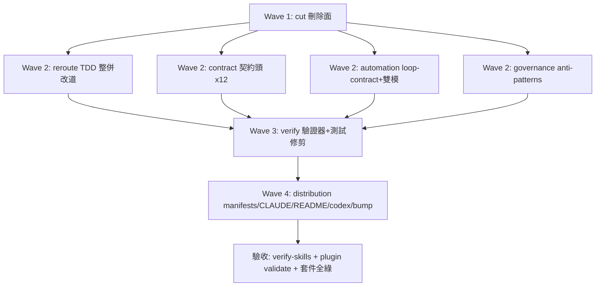
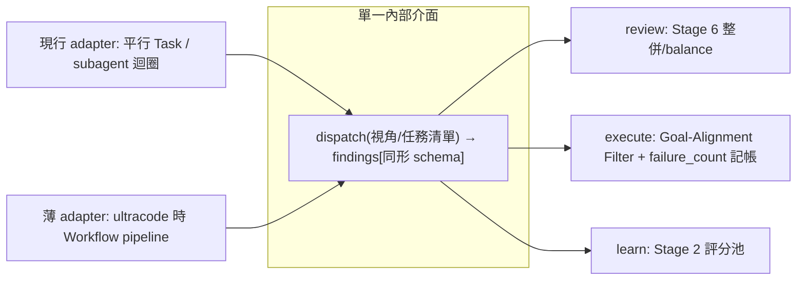
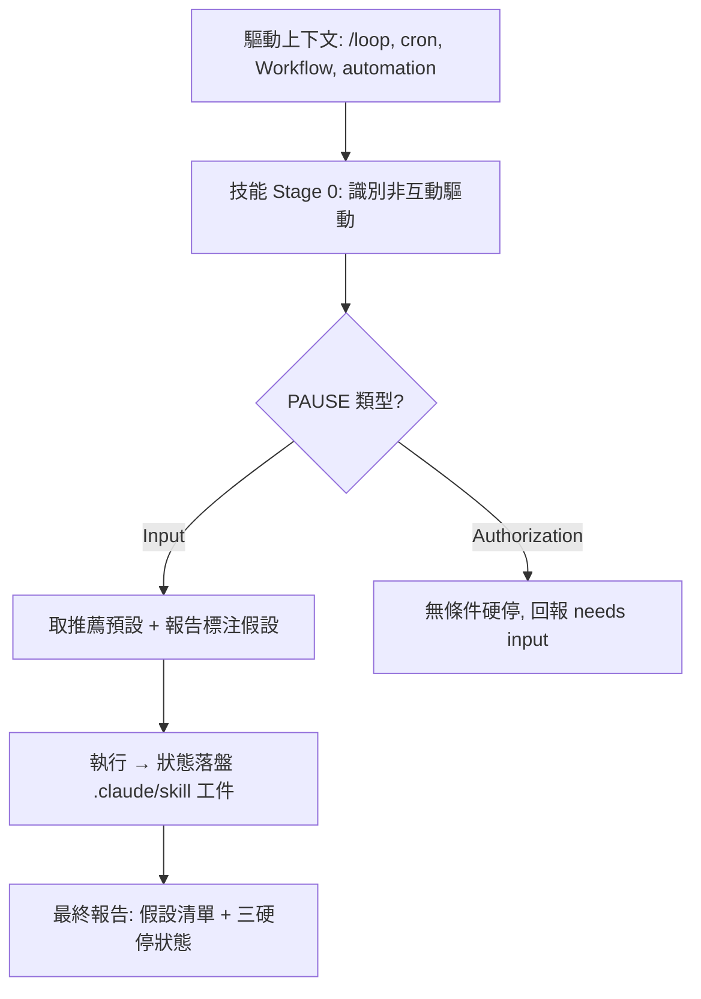

# Design

## 系統架構

baransu 的發行面分五個區塊，本次變更各區塊的角色：

| 區塊 | 內容 | 本次動作 |
|------|------|---------|
| 技能層 `plugins/baransu/skills/` | 16 個技能目錄 + `_shared/` | 刪 4、改 12（契約頭＋標注＋薄 adapter）、`_shared` 刪 3 schema、改 tdd.md、增 loop-contract.md |
| 代理層 `plugins/baransu/agents/` | 13 個 agent 檔 | 刪 investigator-agent.md、改 review-agent.md 錨點；其餘 11 個不動 |
| 執行層 `plugins/baransu/{hooks,scripts}/` | hooks 5 檔、scripts 9 檔 | hooks 刪 3 留 2（hooks.json＋wiki-sync.sh）；scripts 全刪 9、新增 verify-skills.py（置於 repo 根 scripts/ 或 plugin scripts/，見「驗證器位置決策」） |
| 測試層 `tests/` | 37 檔 | 刪 ~28、改 2（baseline 重生、tdd_trigger 修剪）、增 1（verify-skills 負向 fixture 測試）、留 ~6 |
| 發行 metadata | 雙 manifest、CLAUDE.md、README、codex/ | 全部同步至 12 技能；codex/ 重產 |

### 驗證器位置決策

verify-skills.py 放 **repo 根的 `scripts/`**（dev/CI 工具），不放 `plugins/baransu/scripts/`（後者會被打包發行）。理由：驗證器是維護期工具，消費者是 CI 與維護者，不是安裝端使用者；放發行面只會增加安裝體積。這也讓「plugins/baransu/scripts/ 整個目錄刪空」成為乾淨的驗收條件。注意 repo 根 scripts/ 現不存在，須新建。

## 整體操作流程（執行序）

刪除先行的理由：所有後續編輯的殘留掃描以「刪除後」狀態為基準；契約/自動化/治理三組互不依賴可平行。

## 雙模單一介面設計（REQ-004 核心）

三技能各定義一個「編排介面」，兩個 adapter 都實作它；介面是 SKILL.md 內的契約段落，不是程式碼：

介面契約要點（寫入各技能 `references/orchestration-interface.md`，SKILL.md 僅留 ≤10 行指針段 — 官方 progressive-disclosure 慣例，且 execute/SKILL.md 已超官方 500 行上限不得再實質增長）：
1. **回傳同形**：findings/結果的欄位、tier 語彙、引用格式與現行路徑完全一致 — 下游消費者（review 的 Stage 6、execute 的 filter 與記帳、learn 的評分表）不感知模式。
2. **Stage 0 模式釘死**：session 開始時偵測 ultracode（system-reminder 確認）並落盤記錄；整輪不切換；偵測不可靠時退化為「使用者顯式聲明才走 Workflow」。
3. **depth 不變量逐模重述**：「review-agent / perspective agent 不得再呼叫 skill、不得互審」在現行 adapter 與 Workflow adapter 兩個章節各寫一次。
4. **薄 adapter 的「薄」**：Workflow 章節只描述「用 pipeline/parallel 派發、收同形結果」，不複製業務規則；業務規則（lane-keeping、balance check、failure_count）只在主流程寫一次。

## loop-contract 資料流

三硬停的承接：迭代上限與無進展偵測由驅動方（/loop、Workflow script）持有；技能側義務是「可重入＋狀態落盤＋無進展時明確回報而非重試」。預算上限由 harness 的 budget 機制持有。loop-contract.md 記錄這個責任分界。

## 資料模型

無資料庫。關鍵「資料」是三份契約文件的 schema：

| 文件 | 結構 |
|------|------|
| Outcome Contract（每個 SKILL.md 頭部） | 四行定式：Outcome（一句）/ Done when（可驗證或事件型）/ Evidence（判定依據）/ Output（產物形態） |
| loop-contract.md | 規則段（PAUSE 語義、覆寫優先序、三硬停責任分界）＋ PAUSE 分類表（技能 × 互動點 × Input/Authorization × 預設值） |
| verify-skills.py 檢查項 | frontmatter 解析（兩風格）＋官方細目（name ≤64 小寫連字符、description 非空 ≤1024、第三人稱啟發式）、引用存在且一層深、殘留掃描（glob＋排除規則內嵌）、版本一致、契約四行＋第五行 Automation 標注、500 行 advisory；exit 0/1/2（2=結構錯誤，沿用倉內 gate 慣例）。depth 不變量的文字層計數（每 reference 檔 ≥2）可納入；行為層違反（agent 實際呼叫 skill）不納自動驗證，留給 spec review 與 execute 既有測試 |

## 官方 best practices 對齊（2026-06-10 官方文件查核結果）

- **自訂 frontmatter 欄位**：官方建議僅用標準欄位（跨平台相容；非標準欄位被忽略）→ 雙軸 automation 標注放 SKILL.md 契約區塊第五行，不放 frontmatter。
- **500 行上限**：官方明訂 SKILL.md 本文 <500 行 → 新增內容（介面契約、薄 adapter）一律走 references/ 一層深；verify-skills.py 對超限檔出 advisory 清單（execute 為既有超限戶）。
- **references 一層深**：所有新 reference 檔直接從 SKILL.md 連結，禁巢狀（官方警告巢狀導致 partial read）。
- **frontmatter 機器檢查**：name ≤64 小寫連字符、description 非空 ≤1024、第三人稱 — 納入 verify-skills.py。
- **evaluation-first**：verify-skills.py 採測試先行（負向 fixture 先紅）— 與官方「Build evaluations BEFORE writing extensive documentation」一致。
- **headless/cron 場景**：官方文件未覆蓋 → loop-contract.md 是插件層慣例，需自我聲明非官方標準。

## 錯誤處理策略

- verify-skills.py：單項失敗收集後一次輸出全部違規（不 fail-fast），exit 1；無法解析的檔案 exit 2 並指名路徑。
- codex/ 重產失敗（/codex-skill-transfer 拒絕或部分輸出）：不手補 codex/ — 重產是原子動作，失敗就回報並把 codex/ 重產列為阻塞項。
- 測試修剪後若存活測試出現非預期紅燈：先判定是裁併破壞還是既有紅燈（test-settings-registration 是已知既有紅燈，刪除即可），不得為過閘而改測試斷言語義。
- settings.json 升級註記：寫入 release notes 草稿，不主動改使用者 settings。
- release notes 草稿工件：由 distribution 群產出，存放 `.claude/execute/release-notes-draft.md`；必含三段 — (a) 16→12 清單與升級指示（曾安裝者自 settings.json 移除三個 telemetry hook 條目）、(b) 閘門語義降級記錄（舊：小任務 TDD 閘 workflow-enforced；新：discipline-suggested；遷移指引：依 _shared/tdd.md 自建紅綠 task list）、(c) 新治理資產一覽。
