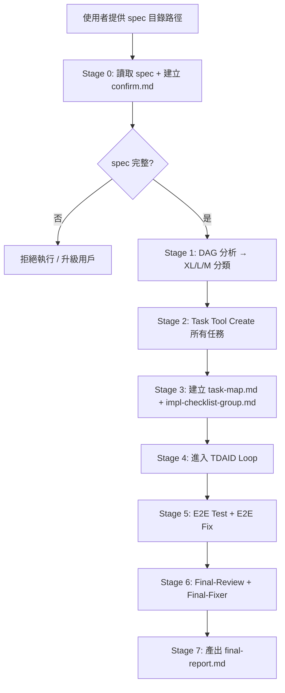
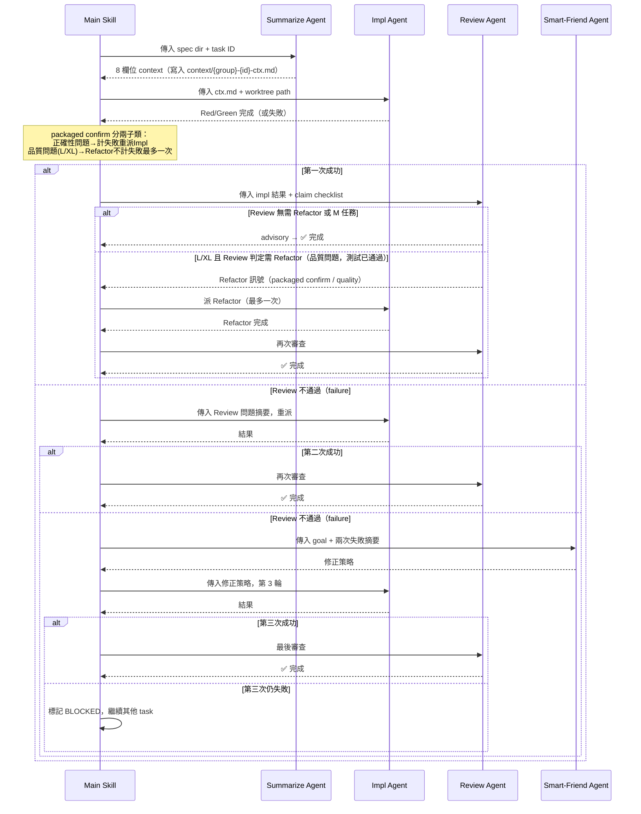
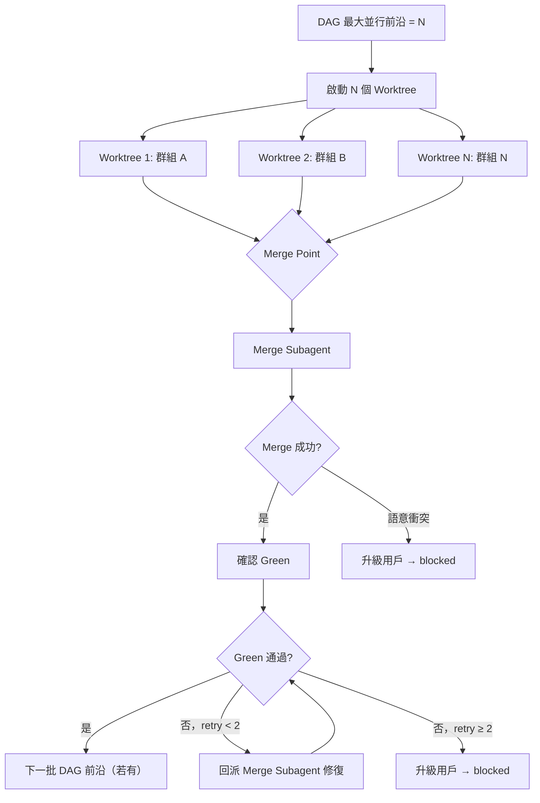
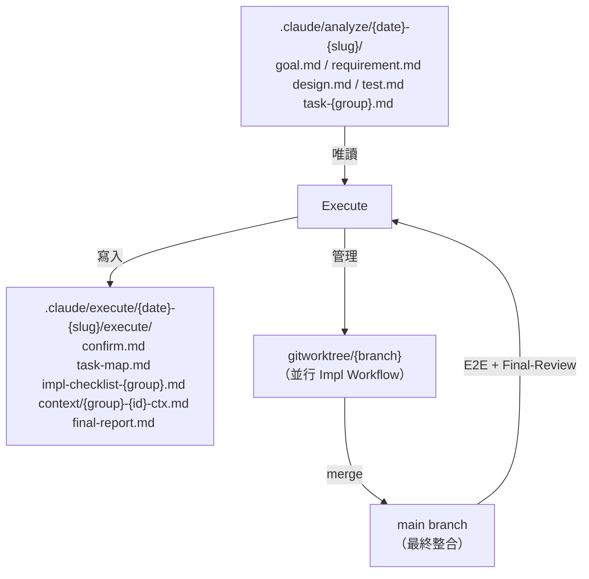

# Design

## 系統架構

`/baransu:execute` 是一個「指揮者」skill，本身不寫任何程式碼——它讀取 Analyze spec、建立任務、派遣 subagent、控制 while loop、處理障礙、產出報告。所有實際工作（摘要、實作、審查、修復）由 7 個 agent-only skill 完成。

### 主要元件

| 元件 | 類型 | 職責 |
|------|------|------|
| `skills/execute/SKILL.md` | 主 skill（指揮者） | 流程編排、狀態追蹤、障礙升級 |
| `agents/summarize-agent.md` | Agent-only skill | 從 spec 提取單一 task 的 8 欄位 context |
| `agents/impl-agent.md` | Agent-only skill | Red/Green TDD 實作 |
| `agents/review-agent.md` | Agent-only skill | 直接實作四層語義審查，回傳結構化結果（不呼叫 /baransu:review，subagent 深度限制）|
| `agents/smart-friend-agent.md` | Agent-only skill | 失敗 2 次後的方向對焦（extended thinking） |
| `agents/e2e-fix-agent.md` | Agent-only skill | E2E 失敗修復 |
| `agents/final-review-agent.md` | Agent-only skill | Requirements 100% 驗收 |
| `agents/final-fixer-agent.md` | Agent-only skill | Final-Review 失敗修復 |
| `agents/merge-agent.md` | Agent-only skill | 並行 worktree merge 執行 + Green 確認後回報 |

### Agent-only skill 結構規範

每個 `agents/*.md` 文件包含以下四個 section，固定部分在前（供 prompt cache）：

```
# {agent name}
視角：{agent 的觀察角度}
目標：{agent 要達成什麼}
通用原則：{執行規則列表}
禁忌：{不做什麼}
```

禁止使用 "you are a senior X" 角色扮演描述。動態參數（task context、失敗摘要等）在 static prefix 之後注入，不破壞 cache 命中。

---

## 主要執行流程



---

## Stage 1 詳細說明：DAG 分析與 Pre-scan

Execute 從所有 task-{group}.md 的 `前置群組` 欄位建立有向無環圖（DAG），再以拓撲排序計算最大並行前沿寬度：

- **≥4 → XL**：啟動 4 個並行 Impl Workflow（gitworktree）
- **2–3 → L**：啟動 2–3 個並行 Impl Workflow
- **1 → M**：單一序列執行，無 gitworktree

**Cascade-blocked 規則**：當 task A 被標記為 blocked 時，所有以 A 所在群組為唯一未完成前置的後繼群組自動標記為 cascade-blocked（記錄到 final-report.md blocked 清單），不再等待。若後繼群組有其他前置群組尚未 blocked，仍正常等待。

**Pre-scan 檔案重疊偵測（Advisory）**：在啟動 worktree 之前，掃描所有被分類為同一並行前沿的群組，依 task 步驟描述推斷目標檔案，比對是否有交集。若偵測到重疊，在 task-map.md 備註欄記錄警告，但不強制序列化——並行仍繼續執行，最終保護由 Merge Point 的語意衝突升級路徑承接。此步驟為 advisory：推斷結果不穩定時寧可漏報，不誤判。

---

## TDAID Loop 詳細設計

### 單一 Task 的執行序列（主 skill 控制）



### 並行策略（XL/L 任務）



---

## 工作空間資料流



---

## 資料模型（工作文件結構）

### confirm.md
```
# Confirm — Execute Session

session_start: {ISO 8601}
spec_dir: {path}

## 已讀取文件

| 檔案 | 讀取時間 |
|------|---------|
| goal.md | {timestamp} |
| requirement.md | {timestamp} |
| design.md | {timestamp} |
| test.md | {timestamp} |
| task-{group}.md | {timestamp} |
```

### task-map.md
```
# Task Map

| Task Tool ID | Group | Task ID | Impl-Checklist |
|-------------|-------|---------|----------------|
| task_xxx | shared | TASK-shared-01 | impl-checklist-shared.md |
```

### impl-checklist-{group}.md
```
# Impl Checklist: {group}

前置群組：{names}

## TASK-{group}-01: {title}
需求追溯：REQ-XXX
- [ ] {驗收標準 1}
- [ ] {驗收標準 2}
Review 結果：{advisory / packaged confirm / needs judgment}
備註：{review subagent 的具體 findings}
```

### final-report.md
```
# Final Report — /baransu:execute

session: {date}-{slug}
spec_dir: {path}
completed_at: {timestamp}

## 整體結果
Requirements 達成率：N/M（N 個 REQ-XXX 有對應綠燈測試）

## Task 完成狀態
| Group | Task | 狀態 | 備註 |
|-------|------|------|------|
| shared | TASK-shared-01 | ✅ | |
| api | TASK-api-01 | ❌ blocked | {原因} |

## E2E 測試結果
{通過 / 失敗原因 / 跳過：未提供啟動命令}

## Final-Review 結論
{通過 / 殘餘問題列表}

## Blocked 項目
| Task | 類型 | 詳情 |
|------|------|------|
| TASK-api-01 | 連續失敗 3 次 | {smart-friend 結論} |
```

---

## 錯誤處理策略

| 錯誤情境 | 偵測層 | 處理方式 |
|---------|--------|---------|
| spec 目錄不存在 | Stage 0 | 立即拒絕，告知先跑 /analyze |
| spec 文件不完整 | Stage 0 | 列出缺失文件，升級用戶 |
| Impl 失敗 1 次 | TDAID loop | 攜帶 Review 問題摘要重試 |
| Impl 失敗 2 次 | TDAID loop | 派 smart-friend 方向對焦後重試 |
| Impl 失敗 3 次 | TDAID loop | 標記 blocked，繼續其他 task |
| Merge 語意衝突 | Merge point | 升級用戶，記錄衝突詳情 |
| Spec 矛盾 | Review subagent | 標記 blocked，不修改 spec |
| E2E 失敗 | E2E stage | 派 E2E Fix subagent（可多個並行）|
| E2E 啟動命令缺失 | E2E stage | 跳過，記錄到 final-report |
| E2E Fix 後 E2E 仍失敗 | E2E stage | 記錄到 final-report.md blocked，不再重試 |
| Final-Review 通過但有 advisory | Final stage | advisory 記錄到 final-report.md，不觸發 Final-Fixer |
| Final-Review 不通過 | Final stage | 派 Final-Fixer，失敗後記錄到 blocked |
| Merge 後 Green 破壞 | Merge point | 回派 Merge Subagent 修復，最多 2 次；超過後升級用戶並標記 blocked |
| 並行群組步驟有檔案重疊 | Stage 1 pre-scan | 將重疊群組序列化，記錄到 task-map.md 備註 |
| 任何寫入 Analyze 文件的嘗試 | 整個流程 | 立即停止，升級為結構性障礙 |
