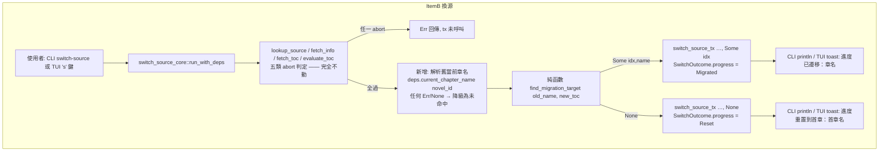
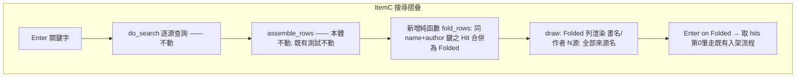
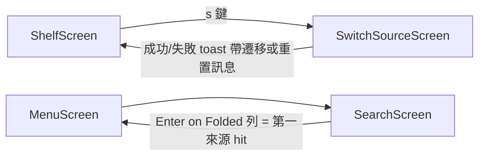
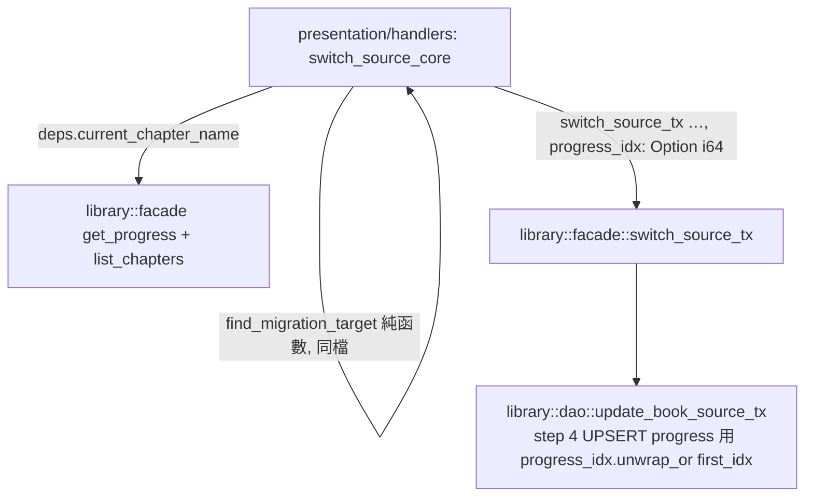

# Design

> **編號防撞聲明**：程式碼註解中的 `REQ-003` / `REQ-005` / `REQ-007` 為舊 spec 遺留編號，與本 spec 的 REQ 編號無關（見 requirement.md 開頭）。實作 agent 不得依程式碼註解回填需求追溯。

## 系統架構

三個工作項各自落在不同 context / 層，互不相依：

| 工作項 | Context / 層 | 觸及檔案 |
|---|---|---|
| A `&` 選擇器 | catalog / service（純 domain） | `src/catalog/service/rule.rs`（唯一） |
| B 進度遷移 | library dao+facade ＋ presentation/handlers | `src/library/dao.rs`、`src/library/facade.rs`、`src/presentation/handlers/switch_source_core.rs`、`src/presentation/handlers/switch_source.rs`、`src/presentation/handlers/tui/switch_source.rs` |
| C 搜尋摺疊 | presentation/handlers/tui | `src/presentation/handlers/tui/search.rs`（唯一） |

分層不變式（CLAUDE.md，硬規則）：
- `service/*.rs` 不 import rusqlite / 任何 dao —— Item A 全程純函數，天然滿足。
- 跨 context 組合只在 `presentation/handlers/` —— Item B 的比對演算法為純 helper，放在 `switch_source_core.rs`（先例：`evaluate_toc` 已是該檔的純判斷函數；`fallback_chapter_name` 亦已示範 presentation 引用 service 純函數）。
- facade 不跨 context 互呼 —— `library::facade::switch_source_tx` 僅擴充參數，不新增任何 catalog 引用。
- `mod.rs` PL 無邏輯 —— 不動任何 `mod.rs`；新型別 `ProgressResolution` 屬 presentation 內部型別，定義於 `switch_source_core.rs`（不是 Library PL，不進 `library/mod.rs`）。

## 整體操作流程





## 畫面關聯（Item B/C 觸及的 TUI 畫面）



## API Sequence

不適用 —— 本次無任何新增/變更之後端 endpoint（純 CLI/TUI 本地程式）。

## 整體資料流（Item B 跨層）



## 資料模型

無新資料表、無 schema migration。`progress` 表結構不變。新增/變更的程式內型別：

| 型別 | 位置 | 形狀 | 說明 |
|---|---|---|---|
| `ProgressResolution` | `switch_source_core.rs`（新 enum） | `Migrated { idx: i64, name: String }` \| `Reset` | presentation 內部型別，非 Library PL |
| `SwitchOutcome` | `switch_source_core.rs`（擴充） | 既有三欄 + `progress: ProgressResolution` | 既有欄位不刪（TUI/CLI 重置訊息仍用 `new_first_chapter_name`） |
| `HitOrStatus::Folded` | `tui/search.rs`（新 variant） | `Folded { hits: Vec<(SearchHit, String)> }`（不變式 len ≥ 2） | 單源列維持 `Hit`，渲染不變 |

### 關鍵函數簽名（實作錨點）

```rust
// --- Item A: src/catalog/service/rule.rs ---
// 修復方式：把 Selector::parse 移到「非 & 分支」內；& 分支直接以 ctx（或
// doc.root_element()）為候選。五個入口統一處理；不改 parse_rule/parse_alt。
// extract_within: 現行 rule.rs:145 的 parse 提前呼叫即 bug 根因。

// --- Item B: src/presentation/handlers/switch_source_core.rs ---
pub enum ProgressResolution { Migrated { idx: i64, name: String }, Reset }
/// 規則 a→b→c 依序；同一規則內沿 new_toc 向量順序（= idx 升冪）取第一命中。
/// 規則 b：雙方去除全部 char::is_whitespace 後相等；舊名去空白後為空字串則跳過規則 b。
/// 規則 c：regex 第\s*([0-9０-９一二三四五六七八九十百千零〇两兩]+)\s*[章回節节卷]
///        首捕獲組；全形數字 ０-９ → 0-9 後以字串比較；雙方皆須有 token。
pub fn find_migration_target(old_name: &str, new_toc: &[ChapterMeta]) -> Option<(i64, String)>;

// SwitchSourceDeps 新增一個方法（fake 只需回 Option<String>）：
//   fn current_chapter_name(&self, novel_id: i64) -> Result<Option<String>>;
// RealDeps 實作 = get_progress(novel_id)? 的 chapter_index → list_chapters 中同 idx 者之 name。
// run_with_deps 呼叫點在 evaluate_toc 之後、switch_source_tx 之前；
// current_chapter_name 回 Err 或 None 一律當未命中（不得新增 abort 出口）。

// --- Item B: src/library/facade.rs / dao.rs ---
// 簽名各加一個尾參數 progress_idx: Option<i64>；None = 現行行為（首章 idx）。
pub fn switch_source_tx(db, novel_id, new_src_url, new_book_url, new_chapters,
                        progress_idx: Option<i64>) -> Result<i64>;
// dao::update_book_source_tx(_inner) 同步加參；step 4 UPSERT 寫
// progress_idx.unwrap_or(first_idx)；回傳值亦為該值。
// 既有呼叫點/測試一律補 None —— 純機械適配，斷言行為不變（C12 合規）。

// --- Item C: src/presentation/handlers/tui/search.rs ---
/// 摺疊 post-pass。鍵 = (hit.name.trim(), hit.author.as_deref().unwrap_or("").trim())。
/// 首次出現的列位保留；第二筆起併入首筆，首筆升級為 Folded。
/// StatusLine 原樣通過。來源名依出現順序；同源重複命中照樣併入（計數含重複）。
pub fn fold_rows(rows: Vec<HitOrStatus>) -> Vec<HitOrStatus>;
// do_search 末行改為 fold_rows(assemble_rows(per_source))。
// draw(): Folded → "{name} / {author或-} [{n}源: {names.join(", ")}]"。
// handle_event Enter: Folded → hits[0].0.clone() 走既有 handle_enter_on_hit。
// first_hit_idx: matches!(r, Hit{..} | Folded{..})。
```

### 設計取捨（已否決之替代方案）

| 決策 | 採用 | 否決 | 理由 |
|---|---|---|---|
| B 比對函數位置 | `switch_source_core.rs` 純 helper | `library/service/progress.rs` 新模組 | 依既有先例（`evaluate_toc`）；比對輸入輸出全是 PL 型別、不碰 DB，放 core 使 deps fake 測試同檔可測；避免為單一函數開新 service 檔 |
| dao 簽名 | 加 `Option<i64>` 尾參 | 新增平行方法 `update_book_source_tx_with_progress` | 單一交易入口維持唯一，避免兩份 tx 邏輯漂移；既有測試補 `None` 為機械適配 |
| 舊章名解析 | deps 方法 `current_chapter_name`（RealDeps 組合 facade） | core 直呼兩個 facade fn | 保持 fake 可測性（B7/C14 要求純邏輯層測試）；與既有 deps seam 風格一致 |
| C 摺疊位置 | `fold_rows` post-pass | 改寫 `assemble_rows` 本體 | 既有 `assemble_rows` 5 條測試可原樣保留（含三源同書出三列之 scenario1），C20 的「既有測試全過」以最低風險達成 |
| C 資料形狀 | 新 variant `Folded` | 在 `Hit` 上加 `sources: Vec<String>` | 單源列型別完全不變 → C17「單源渲染與現況相同」由型別保證 |

## 錯誤處理策略

| 層 | 情境 | 處理 |
|---|---|---|
| rule.rs（A） | `&` alternative | 不進 `Selector::parse`，故無 parse 錯誤路徑；`&` 取值為空 → 照常視為未命中、落入下一個 `||` alternative（既有語意） |
| rule.rs（A） | 非 `&` selector 非法 | 照舊回 `Err(bad selector ...)` —— 不改 |
| switch_source_core（B） | 五類 abort | 完全不動；章名解析與比對位於 abort 判定**之後**、tx **之前**，不新增失敗出口 |
| switch_source_core（B） | `current_chapter_name` 回 `Err` / `None`、比對未命中 | 一律降級 `ProgressResolution::Reset`（best-effort 語意；換源本身照常成功） |
| dao（B） | tx 任一步 Err | 照舊 rollback（`Transaction` Drop）；`progress_idx` 參數不影響 rollback 語意 |
| CLI/TUI（B） | 成功兩態 | CLI 印 stdout、TUI toast；失敗路徑訊息完全沿用現行 anyhow chain |
| tui/search（C） | `fold_rows` | 純函數無 Err 路徑；StatusLine 原樣傳遞；空輸入回空輸出 |
