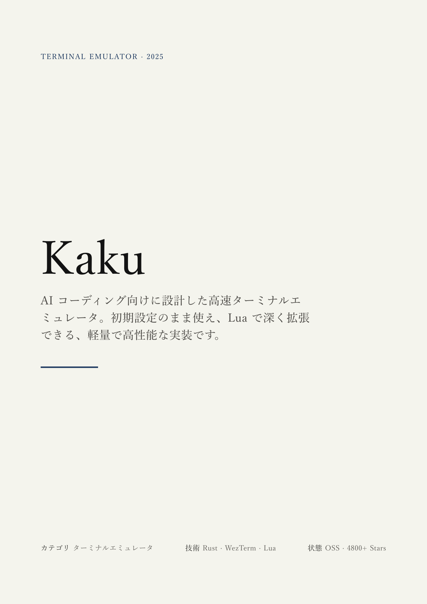
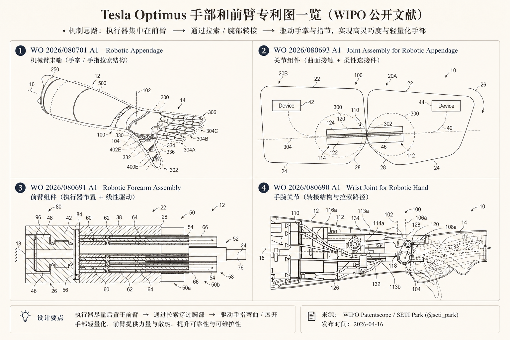
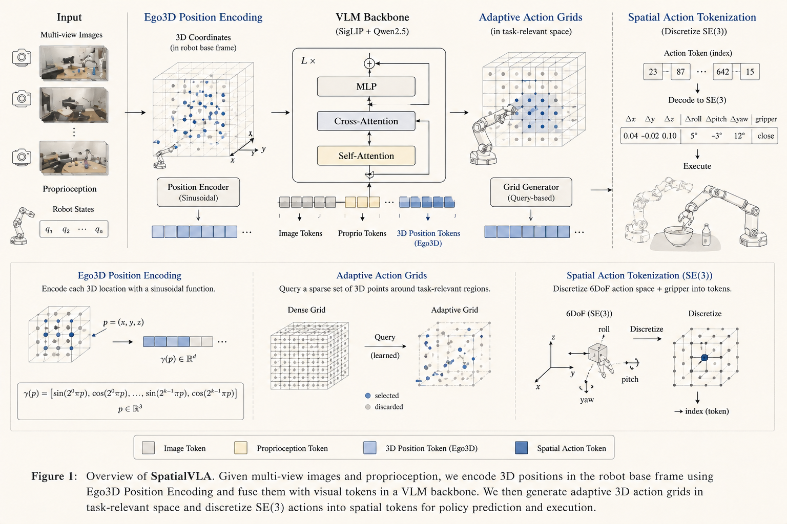
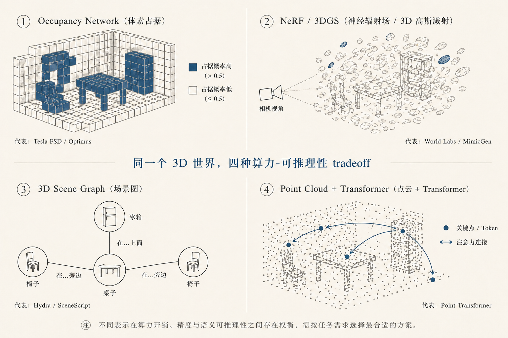

Title: GitHub - tw93/Kami: 👩‍🚒 Good content deserves good paper.

URL Source: https://github.com/tw93/Kami

Markdown Content:
# GitHub - tw93/Kami: 👩‍🚒 Good content deserves good paper. · GitHub

[Skip to content](https://github.com/tw93/Kami#start-of-content)
## Navigation Menu

Toggle navigation

[Sign in](https://github.com/login?return_to=https%3A%2F%2Fgithub.com%2Ftw93%2FKami)

Appearance settings

*
Platform

    *
AI CODE CREATION
        *   [GitHub Copilot Write better code with AI](https://github.com/features/copilot)
        *   [GitHub Spark Build and deploy intelligent apps](https://github.com/features/spark)
        *   [GitHub Models Manage and compare prompts](https://github.com/features/models)
        *   [MCP Registry New Integrate external tools](https://github.com/mcp)

    *
DEVELOPER WORKFLOWS
        *   [Actions Automate any workflow](https://github.com/features/actions)
        *   [Codespaces Instant dev environments](https://github.com/features/codespaces)
        *   [Issues Plan and track work](https://github.com/features/issues)
        *   [Code Review Manage code changes](https://github.com/features/code-review)

    *
APPLICATION SECURITY
        *   [GitHub Advanced Security Find and fix vulnerabilities](https://github.com/security/advanced-security)
        *   [Code security Secure your code as you build](https://github.com/security/advanced-security/code-security)
        *   [Secret protection Stop leaks before they start](https://github.com/security/advanced-security/secret-protection)

    *
EXPLORE
        *   [Why GitHub](https://github.com/why-github)
        *   [Documentation](https://docs.github.com/)
        *   [Blog](https://github.blog/)
        *   [Changelog](https://github.blog/changelog)
        *   [Marketplace](https://github.com/marketplace)

[View all features](https://github.com/features)

*
Solutions

    *
BY COMPANY SIZE
        *   [Enterprises](https://github.com/enterprise)
        *   [Small and medium teams](https://github.com/team)
        *   [Startups](https://github.com/enterprise/startups)
        *   [Nonprofits](https://github.com/solutions/industry/nonprofits)

    *
BY USE CASE
        *   [App Modernization](https://github.com/solutions/use-case/app-modernization)
        *   [DevSecOps](https://github.com/solutions/use-case/devsecops)
        *   [DevOps](https://github.com/solutions/use-case/devops)
        *   [CI/CD](https://github.com/solutions/use-case/ci-cd)
        *   [View all use cases](https://github.com/solutions/use-case)

    *
BY INDUSTRY
        *   [Healthcare](https://github.com/solutions/industry/healthcare)
        *   [Financial services](https://github.com/solutions/industry/financial-services)
        *   [Manufacturing](https://github.com/solutions/industry/manufacturing)
        *   [Government](https://github.com/solutions/industry/government)
        *   [View all industries](https://github.com/solutions/industry)

[View all solutions](https://github.com/solutions)

*
Resources

    *
EXPLORE BY TOPIC
        *   [AI](https://github.com/resources/articles?topic=ai)
        *   [Software Development](https://github.com/resources/articles?topic=software-development)
        *   [DevOps](https://github.com/resources/articles?topic=devops)
        *   [Security](https://github.com/resources/articles?topic=security)
        *   [View all topics](https://github.com/resources/articles)

    *
EXPLORE BY TYPE
        *   [Customer stories](https://github.com/customer-stories)
        *   [Events & webinars](https://github.com/resources/events)
        *   [Ebooks & reports](https://github.com/resources/whitepapers)
        *   [Business insights](https://github.com/solutions/executive-insights)
        *   [GitHub Skills](https://skills.github.com/)

    *
SUPPORT & SERVICES
        *   [Documentation](https://docs.github.com/)
        *   [Customer support](https://support.github.com/)
        *   [Community forum](https://github.com/orgs/community/discussions)
        *   [Trust center](https://github.com/trust-center)
        *   [Partners](https://github.com/partners)

[View all resources](https://github.com/resources)

*
Open Source

    *
COMMUNITY
        *   [GitHub Sponsors Fund open source developers](https://github.com/sponsors)

    *
PROGRAMS
        *   [Security Lab](https://securitylab.github.com/)
        *   [Maintainer Community](https://maintainers.github.com/)
        *   [Accelerator](https://github.com/accelerator)
        *   [GitHub Stars](https://stars.github.com/)
        *   [Archive Program](https://archiveprogram.github.com/)

    *
REPOSITORIES
        *   [Topics](https://github.com/topics)
        *   [Trending](https://github.com/trending)
        *   [Collections](https://github.com/collections)

*
Enterprise

    *
ENTERPRISE SOLUTIONS
        *   [Enterprise platform AI-powered developer platform](https://github.com/enterprise)

    *
AVAILABLE ADD-ONS
        *   [GitHub Advanced Security Enterprise-grade security features](https://github.com/security/advanced-security)
        *   [Copilot for Business Enterprise-grade AI features](https://github.com/features/copilot/copilot-business)
        *   [Premium Support Enterprise-grade 24/7 support](https://github.com/premium-support)

*   [Pricing](https://github.com/pricing)

Search or jump to...

# Search code, repositories, users, issues, pull requests...

 Search

Clear

[Search syntax tips](https://docs.github.com/search-github/github-code-search/understanding-github-code-search-syntax)

# Provide feedback

We read every piece of feedback, and take your input very seriously.

- [x] Include my email address so I can be contacted

 Cancel  Submit feedback

# Saved searches

## Use saved searches to filter your results more quickly

Name

Query

To see all available qualifiers, see our [documentation](https://docs.github.com/search-github/github-code-search/understanding-github-code-search-syntax).

 Cancel  Create saved search

[Sign in](https://github.com/login?return_to=https%3A%2F%2Fgithub.com%2Ftw93%2FKami)

[Sign up](https://github.com/signup?ref_cta=Sign+up&ref_loc=header+logged+out&ref_page=%2F%3Cuser-name%3E%2F%3Crepo-name%3E&source=header-repo&source_repo=tw93%2FKami)

Appearance settings

Resetting focus

You signed in with another tab or window. [Reload](https://github.com/tw93/Kami) to refresh your session.You signed out in another tab or window. [Reload](https://github.com/tw93/Kami) to refresh your session.You switched accounts on another tab or window. [Reload](https://github.com/tw93/Kami) to refresh your session.Dismiss alert

{{ message }}

[tw93](https://github.com/tw93)/**[Kami](https://github.com/tw93/Kami)**Public

*   Sponsor# Sponsor tw93/Kami    ##### GitHub Sponsors

[Learn more about Sponsors](https://github.com/sponsors) [tw93](https://github.com/tw93)

[tw93](https://github.com/tw93) [Sponsor](https://github.com/sponsors/tw93)
##### External links

 [https://cats.tw93.fun?name=Kami](https://cats.tw93.fun/?name=Kami)   [Learn more about funding links in repositories](https://docs.github.com/repositories/managing-your-repositorys-settings-and-features/customizing-your-repository/displaying-a-sponsor-button-in-your-repository).

[Report abuse](https://github.com/contact/report-abuse?report=tw93%2FKami+%28Repository+Funding+Links%29)
*   [Notifications](https://github.com/login?return_to=%2Ftw93%2FKami)You must be signed in to change notification settings
*   [Fork 259](https://github.com/login?return_to=%2Ftw93%2FKami)
*   [Star 5k](https://github.com/login?return_to=%2Ftw93%2FKami)

*   [Code](https://github.com/tw93/Kami)
*   [Issues 0](https://github.com/tw93/Kami/issues)
*   [Pull requests 0](https://github.com/tw93/Kami/pulls)
*   [Actions](https://github.com/tw93/Kami/actions)
*   [Security and quality 0](https://github.com/tw93/Kami/security)
*   [Insights](https://github.com/tw93/Kami/pulse)

Additional navigation options

*   [Code](https://github.com/tw93/Kami)
*   [Issues](https://github.com/tw93/Kami/issues)
*   [Pull requests](https://github.com/tw93/Kami/pulls)
*   [Actions](https://github.com/tw93/Kami/actions)
*   [Security and quality](https://github.com/tw93/Kami/security)
*   [Insights](https://github.com/tw93/Kami/pulse)

# tw93/Kami

main

[**1**Branch](https://github.com/tw93/Kami/branches)[**7**Tags](https://github.com/tw93/Kami/tags)

Go to file

Code

Open more actions menu

## Folders and files

| Name | Name | Last commit message | Last commit date |
| --- | --- | --- | --- |
| ## Latest commit  [tw93](https://github.com/tw93/Kami/commits?author=tw93) and [claude](https://github.com/tw93/Kami/commits?author=claude) [chore: refresh kami.zip for V1.4.2](https://github.com/tw93/Kami/commit/2ee9cebd7663e35b047304ab0b307d43f05f1dab) Open commit details success May 10, 2026 [2ee9ceb](https://github.com/tw93/Kami/commit/2ee9cebd7663e35b047304ab0b307d43f05f1dab)·May 10, 2026 ## History [159 Commits](https://github.com/tw93/Kami/commits/main/) Open commit details 159 Commits |
| [.claude-plugin](https://github.com/tw93/Kami/tree/main/.claude-plugin ".claude-plugin") | [.claude-plugin](https://github.com/tw93/Kami/tree/main/.claude-plugin ".claude-plugin") | [chore: audit-driven cleanup across templates, diagrams, scripts, and …](https://github.com/tw93/Kami/commit/39cca710baa43a614ed93c9e32be31bbe286ab09 "chore: audit-driven cleanup across templates, diagrams, scripts, and docs Fix spec violations and tighten the build pipeline; align public-site visibility surfaces; sediment six new visual-QA pitfalls. Templates / diagrams - resume CN @page margin 9mm -> 11mm (matches design.md spec) - slides-weasy.html CDN normalized to jsdelivr + format(\"truetype\") - portfolio-en cover line-height 1.02 -> 1.10 (above headline floor) - one-pager and letter: comment intentional EN/CN locale tuning - 14 diagrams cleaned in one pass: SVG font-weight 600 -> 500, italic removed, rgba -> solid hex pre-blended on parchment, white -> ivory, drop dead --mist / --grid / --light-stone tokens - references/diagrams.md token map updated with shared <defs> snippet - CHEATSHEET margin table covers equity-report and changelog - CHEATSHEET invariant 4 reworded (single serif per page; --sans alias) Public site / i18n - Doc-type count 6 -> 8 across README, 3 index pages, JSON-LD, llms.txt, SKILL.md - EN/JA duplicate \"08\" section renumbered (Anti-Patterns -> 09, Background -> 10, FAQ -> 11) - zh/ja JSON-LD adds install FAQ + offers/operatingSystem/sameAs parity - canonical + hreflang + Open Graph + Twitter cards on all 3 locales - llms.txt adds JA showcase URL - marketplace.json homepage casing tw93/Kami -> tw93/kami - sitemap.xml lastmod bumped with workflow note Build pipeline - HTML_TEMPLATES lifted into shared.py as single source of truth; build.py and stabilize.py both derive from it (fixes max_pages drift) - scan_file no longer skips CSS #id selector lines (caught more rgba / cool-gray violations that previously slipped) - ensure-fonts.sh portable across bash 3.2+ (parallel arrays, no associative arrays); CDN order documented as intentional - XDG_CACHE_HOME default only on macOS; falls back to ~/.cache on Linux - --check-orphans, --check-density, --check-rhythm exit non-zero on invalid input or unparseable decks - PARCHMENT_RGB centralized in shared.py - New scripts/tests/test_build.py with 12 cases (no third-party deps) References / sediment - tokens.json: 9 -> 13 keys (--sand, --border, --border-soft, --brand-tint, --brand-tint-strong) - production.md: 16 -> 22 pitfalls. New entries cover: 17 figure SVG max-height starves width on wide viewBoxes 18 multi-column metric labels need word-budget discipline 19 multi-column body density imbalance breaks rhythm 20 demo / template HTML must reference assets in-repo 21 metric row baseline-align breaks when any label wraps 22 slide bullets prefer numerals or bullet over en-dash - CHEATSHEET quick-decisions table cross-references each new pitfall - AGENTS.md repository map adds CLAUDE.md, resume-writing.md, anti-patterns.md, marketplace.json") | May 5, 2026 |
| [.github](https://github.com/tw93/Kami/tree/main/.github ".github") | [.github](https://github.com/tw93/Kami/tree/main/.github ".github") | [ci: add check and release workflows](https://github.com/tw93/Kami/commit/42b64aa1aa5b4b45e9564de6f669e046c9c86f0f "ci: add check and release workflows check.yml runs on push to main and on every PR: lint templates with build.py --check, run the test suite, and rebuild kami.zip via package-skill.sh as an end-to-end smoke check (no upload). release.yml fires on V* tag pushes (and manual dispatch with a tag input): build kami.zip on a clean clone, ensure the GitHub release exists, then upload the archive with --clobber so manual notes survive a re-run.") | May 6, 2026 |
| [assets](https://github.com/tw93/Kami/tree/main/assets "assets") | [assets](https://github.com/tw93/Kami/tree/main/assets "assets") | [fix: stabilize Chinese slides fonts and install guidance](https://github.com/tw93/Kami/commit/427221e5d6fa0d01f9dd11d0940275db8a3c5263 "fix: stabilize Chinese slides fonts and install guidance") | May 9, 2026 |
| [dist](https://github.com/tw93/Kami/tree/main/dist "dist") | [dist](https://github.com/tw93/Kami/tree/main/dist "dist") | [chore: refresh kami.zip for V1.4.2](https://github.com/tw93/Kami/commit/2ee9cebd7663e35b047304ab0b307d43f05f1dab "chore: refresh kami.zip for V1.4.2 Rebuild via package-skill.sh so the archive picks up 427221e's Chinese slides font stabilization. Previous zip from 2880ec6 predates that fix. Co-Authored-By: Claude Opus 4.7 <noreply@anthropic.com>") | May 10, 2026 |
| [references](https://github.com/tw93/Kami/tree/main/references "references") | [references](https://github.com/tw93/Kami/tree/main/references "references") | [chore: audit-driven cleanup across templates, diagrams, scripts, and …](https://github.com/tw93/Kami/commit/39cca710baa43a614ed93c9e32be31bbe286ab09 "chore: audit-driven cleanup across templates, diagrams, scripts, and docs Fix spec violations and tighten the build pipeline; align public-site visibility surfaces; sediment six new visual-QA pitfalls. Templates / diagrams - resume CN @page margin 9mm -> 11mm (matches design.md spec) - slides-weasy.html CDN normalized to jsdelivr + format(\"truetype\") - portfolio-en cover line-height 1.02 -> 1.10 (above headline floor) - one-pager and letter: comment intentional EN/CN locale tuning - 14 diagrams cleaned in one pass: SVG font-weight 600 -> 500, italic removed, rgba -> solid hex pre-blended on parchment, white -> ivory, drop dead --mist / --grid / --light-stone tokens - references/diagrams.md token map updated with shared <defs> snippet - CHEATSHEET margin table covers equity-report and changelog - CHEATSHEET invariant 4 reworded (single serif per page; --sans alias) Public site / i18n - Doc-type count 6 -> 8 across README, 3 index pages, JSON-LD, llms.txt, SKILL.md - EN/JA duplicate \"08\" section renumbered (Anti-Patterns -> 09, Background -> 10, FAQ -> 11) - zh/ja JSON-LD adds install FAQ + offers/operatingSystem/sameAs parity - canonical + hreflang + Open Graph + Twitter cards on all 3 locales - llms.txt adds JA showcase URL - marketplace.json homepage casing tw93/Kami -> tw93/kami - sitemap.xml lastmod bumped with workflow note Build pipeline - HTML_TEMPLATES lifted into shared.py as single source of truth; build.py and stabilize.py both derive from it (fixes max_pages drift) - scan_file no longer skips CSS #id selector lines (caught more rgba / cool-gray violations that previously slipped) - ensure-fonts.sh portable across bash 3.2+ (parallel arrays, no associative arrays); CDN order documented as intentional - XDG_CACHE_HOME default only on macOS; falls back to ~/.cache on Linux - --check-orphans, --check-density, --check-rhythm exit non-zero on invalid input or unparseable decks - PARCHMENT_RGB centralized in shared.py - New scripts/tests/test_build.py with 12 cases (no third-party deps) References / sediment - tokens.json: 9 -> 13 keys (--sand, --border, --border-soft, --brand-tint, --brand-tint-strong) - production.md: 16 -> 22 pitfalls. New entries cover: 17 figure SVG max-height starves width on wide viewBoxes 18 multi-column metric labels need word-budget discipline 19 multi-column body density imbalance breaks rhythm 20 demo / template HTML must reference assets in-repo 21 metric row baseline-align breaks when any label wraps 22 slide bullets prefer numerals or bullet over en-dash - CHEATSHEET quick-decisions table cross-references each new pitfall - AGENTS.md repository map adds CLAUDE.md, resume-writing.md, anti-patterns.md, marketplace.json") | May 5, 2026 |
| [scripts](https://github.com/tw93/Kami/tree/main/scripts "scripts") | [scripts](https://github.com/tw93/Kami/tree/main/scripts "scripts") | [fix: stabilize Chinese slides fonts and install guidance](https://github.com/tw93/Kami/commit/427221e5d6fa0d01f9dd11d0940275db8a3c5263 "fix: stabilize Chinese slides fonts and install guidance") | May 9, 2026 |
| [.gitignore](https://github.com/tw93/Kami/blob/main/.gitignore ".gitignore") | [.gitignore](https://github.com/tw93/Kami/blob/main/.gitignore ".gitignore") | [chore: clean up local-only docs](https://github.com/tw93/Kami/commit/fc8945d6f00cfeaa0d0caf683087f89eab67128f "chore: clean up local-only docs") | May 7, 2026 |
| [CHEATSHEET.md](https://github.com/tw93/Kami/blob/main/CHEATSHEET.md "CHEATSHEET.md") | [CHEATSHEET.md](https://github.com/tw93/Kami/blob/main/CHEATSHEET.md "CHEATSHEET.md") | [chore: audit-driven cleanup across templates, diagrams, scripts, and …](https://github.com/tw93/Kami/commit/39cca710baa43a614ed93c9e32be31bbe286ab09 "chore: audit-driven cleanup across templates, diagrams, scripts, and docs Fix spec violations and tighten the build pipeline; align public-site visibility surfaces; sediment six new visual-QA pitfalls. Templates / diagrams - resume CN @page margin 9mm -> 11mm (matches design.md spec) - slides-weasy.html CDN normalized to jsdelivr + format(\"truetype\") - portfolio-en cover line-height 1.02 -> 1.10 (above headline floor) - one-pager and letter: comment intentional EN/CN locale tuning - 14 diagrams cleaned in one pass: SVG font-weight 600 -> 500, italic removed, rgba -> solid hex pre-blended on parchment, white -> ivory, drop dead --mist / --grid / --light-stone tokens - references/diagrams.md token map updated with shared <defs> snippet - CHEATSHEET margin table covers equity-report and changelog - CHEATSHEET invariant 4 reworded (single serif per page; --sans alias) Public site / i18n - Doc-type count 6 -> 8 across README, 3 index pages, JSON-LD, llms.txt, SKILL.md - EN/JA duplicate \"08\" section renumbered (Anti-Patterns -> 09, Background -> 10, FAQ -> 11) - zh/ja JSON-LD adds install FAQ + offers/operatingSystem/sameAs parity - canonical + hreflang + Open Graph + Twitter cards on all 3 locales - llms.txt adds JA showcase URL - marketplace.json homepage casing tw93/Kami -> tw93/kami - sitemap.xml lastmod bumped with workflow note Build pipeline - HTML_TEMPLATES lifted into shared.py as single source of truth; build.py and stabilize.py both derive from it (fixes max_pages drift) - scan_file no longer skips CSS #id selector lines (caught more rgba / cool-gray violations that previously slipped) - ensure-fonts.sh portable across bash 3.2+ (parallel arrays, no associative arrays); CDN order documented as intentional - XDG_CACHE_HOME default only on macOS; falls back to ~/.cache on Linux - --check-orphans, --check-density, --check-rhythm exit non-zero on invalid input or unparseable decks - PARCHMENT_RGB centralized in shared.py - New scripts/tests/test_build.py with 12 cases (no third-party deps) References / sediment - tokens.json: 9 -> 13 keys (--sand, --border, --border-soft, --brand-tint, --brand-tint-strong) - production.md: 16 -> 22 pitfalls. New entries cover: 17 figure SVG max-height starves width on wide viewBoxes 18 multi-column metric labels need word-budget discipline 19 multi-column body density imbalance breaks rhythm 20 demo / template HTML must reference assets in-repo 21 metric row baseline-align breaks when any label wraps 22 slide bullets prefer numerals or bullet over en-dash - CHEATSHEET quick-decisions table cross-references each new pitfall - AGENTS.md repository map adds CLAUDE.md, resume-writing.md, anti-patterns.md, marketplace.json") | May 5, 2026 |
| [LICENSE](https://github.com/tw93/Kami/blob/main/LICENSE "LICENSE") | [LICENSE](https://github.com/tw93/Kami/blob/main/LICENSE "LICENSE") | [Kami is born](https://github.com/tw93/Kami/commit/d068e876f8fae7020ebc089e258cff7e69532052 "Kami is born") | Apr 20, 2026 |
| [README.md](https://github.com/tw93/Kami/blob/main/README.md "README.md") | [README.md](https://github.com/tw93/Kami/blob/main/README.md "README.md") | [fix: stabilize Chinese slides fonts and install guidance](https://github.com/tw93/Kami/commit/427221e5d6fa0d01f9dd11d0940275db8a3c5263 "fix: stabilize Chinese slides fonts and install guidance") | May 9, 2026 |
| [SKILL.md](https://github.com/tw93/Kami/blob/main/SKILL.md "SKILL.md") | [SKILL.md](https://github.com/tw93/Kami/blob/main/SKILL.md "SKILL.md") | [chore: audit-driven cleanup across templates, diagrams, scripts, and …](https://github.com/tw93/Kami/commit/39cca710baa43a614ed93c9e32be31bbe286ab09 "chore: audit-driven cleanup across templates, diagrams, scripts, and docs Fix spec violations and tighten the build pipeline; align public-site visibility surfaces; sediment six new visual-QA pitfalls. Templates / diagrams - resume CN @page margin 9mm -> 11mm (matches design.md spec) - slides-weasy.html CDN normalized to jsdelivr + format(\"truetype\") - portfolio-en cover line-height 1.02 -> 1.10 (above headline floor) - one-pager and letter: comment intentional EN/CN locale tuning - 14 diagrams cleaned in one pass: SVG font-weight 600 -> 500, italic removed, rgba -> solid hex pre-blended on parchment, white -> ivory, drop dead --mist / --grid / --light-stone tokens - references/diagrams.md token map updated with shared <defs> snippet - CHEATSHEET margin table covers equity-report and changelog - CHEATSHEET invariant 4 reworded (single serif per page; --sans alias) Public site / i18n - Doc-type count 6 -> 8 across README, 3 index pages, JSON-LD, llms.txt, SKILL.md - EN/JA duplicate \"08\" section renumbered (Anti-Patterns -> 09, Background -> 10, FAQ -> 11) - zh/ja JSON-LD adds install FAQ + offers/operatingSystem/sameAs parity - canonical + hreflang + Open Graph + Twitter cards on all 3 locales - llms.txt adds JA showcase URL - marketplace.json homepage casing tw93/Kami -> tw93/kami - sitemap.xml lastmod bumped with workflow note Build pipeline - HTML_TEMPLATES lifted into shared.py as single source of truth; build.py and stabilize.py both derive from it (fixes max_pages drift) - scan_file no longer skips CSS #id selector lines (caught more rgba / cool-gray violations that previously slipped) - ensure-fonts.sh portable across bash 3.2+ (parallel arrays, no associative arrays); CDN order documented as intentional - XDG_CACHE_HOME default only on macOS; falls back to ~/.cache on Linux - --check-orphans, --check-density, --check-rhythm exit non-zero on invalid input or unparseable decks - PARCHMENT_RGB centralized in shared.py - New scripts/tests/test_build.py with 12 cases (no third-party deps) References / sediment - tokens.json: 9 -> 13 keys (--sand, --border, --border-soft, --brand-tint, --brand-tint-strong) - production.md: 16 -> 22 pitfalls. New entries cover: 17 figure SVG max-height starves width on wide viewBoxes 18 multi-column metric labels need word-budget discipline 19 multi-column body density imbalance breaks rhythm 20 demo / template HTML must reference assets in-repo 21 metric row baseline-align breaks when any label wraps 22 slide bullets prefer numerals or bullet over en-dash - CHEATSHEET quick-decisions table cross-references each new pitfall - AGENTS.md repository map adds CLAUDE.md, resume-writing.md, anti-patterns.md, marketplace.json") | May 5, 2026 |
| [index-en.html](https://github.com/tw93/Kami/blob/main/index-en.html "index-en.html") | [index-en.html](https://github.com/tw93/Kami/blob/main/index-en.html "index-en.html") | [Add EN/CN/JA homepage flow and stabilize release assets](https://github.com/tw93/Kami/commit/f67642fb6947726e19159498d463072405113b99 "Add EN/CN/JA homepage flow and stabilize release assets") | Apr 23, 2026 |
| [index-ja.html](https://github.com/tw93/Kami/blob/main/index-ja.html "index-ja.html") | [index-ja.html](https://github.com/tw93/Kami/blob/main/index-ja.html "index-ja.html") | [fix: stabilize Chinese slides fonts and install guidance](https://github.com/tw93/Kami/commit/427221e5d6fa0d01f9dd11d0940275db8a3c5263 "fix: stabilize Chinese slides fonts and install guidance") | May 9, 2026 |
| [index-zh.html](https://github.com/tw93/Kami/blob/main/index-zh.html "index-zh.html") | [index-zh.html](https://github.com/tw93/Kami/blob/main/index-zh.html "index-zh.html") | [fix: stabilize Chinese slides fonts and install guidance](https://github.com/tw93/Kami/commit/427221e5d6fa0d01f9dd11d0940275db8a3c5263 "fix: stabilize Chinese slides fonts and install guidance") | May 9, 2026 |
| [index.html](https://github.com/tw93/Kami/blob/main/index.html "index.html") | [index.html](https://github.com/tw93/Kami/blob/main/index.html "index.html") | [fix: stabilize Chinese slides fonts and install guidance](https://github.com/tw93/Kami/commit/427221e5d6fa0d01f9dd11d0940275db8a3c5263 "fix: stabilize Chinese slides fonts and install guidance") | May 9, 2026 |
| [llms.txt](https://github.com/tw93/Kami/blob/main/llms.txt "llms.txt") | [llms.txt](https://github.com/tw93/Kami/blob/main/llms.txt "llms.txt") | [fix: stabilize Chinese slides fonts and install guidance](https://github.com/tw93/Kami/commit/427221e5d6fa0d01f9dd11d0940275db8a3c5263 "fix: stabilize Chinese slides fonts and install guidance") | May 9, 2026 |
| [robots.txt](https://github.com/tw93/Kami/blob/main/robots.txt "robots.txt") | [robots.txt](https://github.com/tw93/Kami/blob/main/robots.txt "robots.txt") | [feat: add AI visibility config (llms.txt, sitemap, JSON-LD)](https://github.com/tw93/Kami/commit/85de4ca8ea30d6ea4d95e326b545aec46673974f "feat: add AI visibility config (llms.txt, sitemap, JSON-LD) Add llms.txt with project description and template listing. Add sitemap.xml for all 3 language pages. Add SoftwareApplication JSON-LD to index.html. Add Sitemap declaration to robots.txt.") | Apr 30, 2026 |
| [sitemap.xml](https://github.com/tw93/Kami/blob/main/sitemap.xml "sitemap.xml") | [sitemap.xml](https://github.com/tw93/Kami/blob/main/sitemap.xml "sitemap.xml") | [chore: audit-driven cleanup across templates, diagrams, scripts, and …](https://github.com/tw93/Kami/commit/39cca710baa43a614ed93c9e32be31bbe286ab09 "chore: audit-driven cleanup across templates, diagrams, scripts, and docs Fix spec violations and tighten the build pipeline; align public-site visibility surfaces; sediment six new visual-QA pitfalls. Templates / diagrams - resume CN @page margin 9mm -> 11mm (matches design.md spec) - slides-weasy.html CDN normalized to jsdelivr + format(\"truetype\") - portfolio-en cover line-height 1.02 -> 1.10 (above headline floor) - one-pager and letter: comment intentional EN/CN locale tuning - 14 diagrams cleaned in one pass: SVG font-weight 600 -> 500, italic removed, rgba -> solid hex pre-blended on parchment, white -> ivory, drop dead --mist / --grid / --light-stone tokens - references/diagrams.md token map updated with shared <defs> snippet - CHEATSHEET margin table covers equity-report and changelog - CHEATSHEET invariant 4 reworded (single serif per page; --sans alias) Public site / i18n - Doc-type count 6 -> 8 across README, 3 index pages, JSON-LD, llms.txt, SKILL.md - EN/JA duplicate \"08\" section renumbered (Anti-Patterns -> 09, Background -> 10, FAQ -> 11) - zh/ja JSON-LD adds install FAQ + offers/operatingSystem/sameAs parity - canonical + hreflang + Open Graph + Twitter cards on all 3 locales - llms.txt adds JA showcase URL - marketplace.json homepage casing tw93/Kami -> tw93/kami - sitemap.xml lastmod bumped with workflow note Build pipeline - HTML_TEMPLATES lifted into shared.py as single source of truth; build.py and stabilize.py both derive from it (fixes max_pages drift) - scan_file no longer skips CSS #id selector lines (caught more rgba / cool-gray violations that previously slipped) - ensure-fonts.sh portable across bash 3.2+ (parallel arrays, no associative arrays); CDN order documented as intentional - XDG_CACHE_HOME default only on macOS; falls back to ~/.cache on Linux - --check-orphans, --check-density, --check-rhythm exit non-zero on invalid input or unparseable decks - PARCHMENT_RGB centralized in shared.py - New scripts/tests/test_build.py with 12 cases (no third-party deps) References / sediment - tokens.json: 9 -> 13 keys (--sand, --border, --border-soft, --brand-tint, --brand-tint-strong) - production.md: 16 -> 22 pitfalls. New entries cover: 17 figure SVG max-height starves width on wide viewBoxes 18 multi-column metric labels need word-budget discipline 19 multi-column body density imbalance breaks rhythm 20 demo / template HTML must reference assets in-repo 21 metric row baseline-align breaks when any label wraps 22 slide bullets prefer numerals or bullet over en-dash - CHEATSHEET quick-decisions table cross-references each new pitfall - AGENTS.md repository map adds CLAUDE.md, resume-writing.md, anti-patterns.md, marketplace.json") | May 5, 2026 |
| [styles.css](https://github.com/tw93/Kami/blob/main/styles.css "styles.css") | [styles.css](https://github.com/tw93/Kami/blob/main/styles.css "styles.css") | [feat: add FAQ section, FAQPage JSON-LD, and descriptive title](https://github.com/tw93/Kami/commit/e341b97643aef29a6a51349bbaf7476762f6c803 "feat: add FAQ section, FAQPage JSON-LD, and descriptive title Add section 10 with 4 FAQ pairs matching the existing design language. Add FAQPage schema for Bing/Copilot. Expand title from \"Kami · Design System\" to include keywords.") | May 1, 2026 |
| [vercel.json](https://github.com/tw93/Kami/blob/main/vercel.json "vercel.json") | [vercel.json](https://github.com/tw93/Kami/blob/main/vercel.json "vercel.json") | [Add EN/CN/JA homepage flow and stabilize release assets](https://github.com/tw93/Kami/commit/f67642fb6947726e19159498d463072405113b99 "Add EN/CN/JA homepage flow and stabilize release assets") | Apr 23, 2026 |
| View all files |

## Repository files navigation

*   [README](https://github.com/tw93/Kami#)
*   [MIT license](https://github.com/tw93/Kami#)

# Kami

**Good content deserves good paper.**

## Why

Kami (紙, かみ) means paper in Japanese: the surface where a finished idea lands. AI can produce documents better than most humans do manually. The missing piece is not capability but constraint: without a design system, every session drifts into generic gray and inconsistent layouts.

Kami fills that gap: one constraint language, eight templates, simple enough for agents to run reliably, strict enough that every output is something you actually want to ship. English and Chinese are first-class; Japanese works via a best-effort CJK path with visual QA before delivery.

Part of a trilogy: [Kaku](https://github.com/tw93/Kaku) (書く) writes code, [Waza](https://github.com/tw93/Waza) (技) drills habits, [Kami](https://github.com/tw93/Kami) (紙) delivers documents.

## See it

**Equity Report** · 中文

Tesla Q1 2026 财报点评

**Slides** · English

Agent keynote, 6 slides

**Resume** · English

Founder CV, 2 pages

**Portfolio** · 日本語

Kaku ターミナル作品集 · 7 ページ

## Usage

**Claude Code**

undefinedshell
npx skills add tw93/kami -a claude-code -g -y
undefined

Note: Claude Code 2.1.136-2.1.138 currently rejects root skill paths during marketplace install. Use the `npx skills` command above until the upstream path validation regression is fixed.

**Generic agents** (Codex, OpenCode, Pi, and other tools that read from `~/.agents/`)

undefinedshell
npx skills add tw93/kami -a '*' -g -y
undefined

**Claude Desktop**

Download [kami.zip](https://github.com/tw93/kami/releases/latest/download/kami.zip), open Customize > Skills > "+" > Create skill, and upload the ZIP directly (no need to unzip).

The ZIP is lightweight: Chinese fonts load from local checkout first, then jsDelivr CDN. If rendering is off, Claude downloads them on the next run. To update: download the same URL, click "..." on the skill card, choose Replace, upload.

The skill auto-triggers from natural requests, no slash command needed. Optimized for English and Chinese; Japanese supported via a best-effort CJK path with visual QA before delivery.

Example prompts by language:

*   English: `make a one-pager for my startup` / `turn this research into a long doc` / `write a formal letter` / `make a portfolio of my projects` / `build me a resume` / `design a slide deck for my talk`
*   中文: `帮我做一份一页纸` / `帮我排版一份长文档` / `帮我写一封正式信件` / `帮我做一份作品集` / `帮我做一份简历` / `帮我做一套演讲幻灯片`
*   日本語: `スタートアップ向けの一枚資料を作って` / `この調査を長文レポートに整えて` / `正式な依頼文を作って` / `プロジェクト作品集を作って` / `履歴書を作って` / `登壇用スライドを作って`

**Optional: brand profile**

Create `~/.config/kami/brand.md` to persist identity, brand, defaults, and writing habits. See [brand.example.md](https://github.com/tw93/Kami/blob/main/references/brand.example.md) for a full template.

The file has YAML frontmatter (structured fields: name, role, email, website, GitHub, brand color, language, page size, currency locale, tone, and more) plus a Markdown body for freeform notes. Kami treats it as the lowest-resolution context: applied only when the current request is ambiguous, and always overridable by what the specific document needs. The goal is to feel familiar across your work without making every output look the same.

## Design

Warm parchment canvas, ink blue as the sole accent, serif carries hierarchy, no hard shadows or flashy palettes. Not a UI framework; a constraint system for printed matter. Documents should read as composed pages, not dashboards.

Eight document types (One-Pager, Long Doc, Letter, Portfolio, Resume, Slides, Equity Report, Changelog) with dedicated EN/CN templates and a best-effort Japanese path. Fourteen inline SVG diagram types included. Kami picks the right variant based on the language you write in.

| Element | Rule |
| --- | --- |
| Canvas | `#f5f4ed` parchment, never pure white |
| Accent | Ink blue `#1B365D` only, no second chromatic hue |
| Neutrals | All warm-toned (yellow-brown undertone), no cool blue-grays |
| Serif | Body 400, headings 500. Avoid synthetic bold |
| Line-height | Tight titles 1.1-1.3, dense body 1.4-1.45, reading body 1.5-1.55 |
| Shadows | Ring or whisper only, no hard drop shadows |
| Tags | Solid hex backgrounds only. `rgba()` triggers a WeasyPrint double-rectangle bug |

**Fonts**: Each language uses a single serif font for the entire page. Chinese: TsangerJinKai02. Japanese: YuMincho. English: Charter. TsangerJinKai is free for personal use, commercial use requires a license from [tsanger.cn](https://tsanger.cn/). All other fonts are system-bundled.

Full spec: [design.md](https://github.com/tw93/Kami/blob/main/references/design.md). Cheatsheet: [CHEATSHEET.md](https://github.com/tw93/Kami/blob/main/CHEATSHEET.md).

## Travel

The same constraint system doubles as a brief you can hand to any drawing tool. Point it at the [references folder](https://github.com/tw93/Kami/blob/main/references) and the output inherits warm parchment, ink-blue restraint, single-line geometric icons, and editorial typography.

> Apply the Kami design system from github.com/tw93/kami/tree/main/references

**Evidence layout** · 中文

Tesla Optimus 手部和前臂专利图一览

**Architecture redraw** · English

SpatialVLA Figure 1, schematic

**Concept tradeoff** · 中文

3D 表示的算力-推理性取舍

Rendered by ChatGPT Images 2.0 in a single pass with no manual touch-up. Kami specifies, the renderer draws.

## Background

I like investing in US equities and ask Claude to write research reports all the time. Every output landed in the same default-doc look: gray, flat, a different layout each session. The structure was hard to scan, the formatting felt dated, and nothing about the page made me want to keep reading. So I started fixing the typography, the palette, the spacing, one rule at a time, until the report became a page I actually enjoyed.

Later I needed to present "The Agent You Don't Know: Principles, Architecture and Engineering Practice." I already had the document and didn't want to build slides from scratch, so I used Claude Design to lay it out in my own style, tweaked it round after round, and eventually got it to a place I was happy with. That process added inline SVG charts, a unified warm palette, and a tighter editorial rhythm. It kept growing until it covered every document I regularly ship, so I kept abstracting the process, and it became kami: one quiet design system I can hand to any agent and trust the output.

## Support

*   If kami helped you, [share it](https://twitter.com/intent/tweet?url=https://github.com/tw93/kami&text=Kami%20-%20A%20quiet%20design%20system%20for%20professional%20documents.) with friends or give it a star.
*   Got ideas or bugs? Open an issue or PR.
*   I have two cats, TangYuan and Coke. If you think kami delights your life, you can feed them [canned food 🥩](https://cats.tw93.fun/?name=Kami).

## License

MIT License for kami code and templates. Feel free to use and contribute.

**Fonts**: TsangerJinKai02 (Chinese) is free for personal use only; commercial use requires a license from [tsanger.cn](https://tsanger.cn/). Charter (English), YuMincho (Japanese), and CJK fallbacks are system-bundled or open-licensed.

## About

👩‍🚒 Good content deserves good paper.

[kami.tw93.fun](https://kami.tw93.fun/ "https://kami.tw93.fun")

### Resources

[Readme](https://github.com/tw93/Kami#readme-ov-file)

### License

[MIT license](https://github.com/tw93/Kami#MIT-1-ov-file)

### Uh oh!

There was an error while loading. [Please reload this page](https://github.com/tw93/Kami).

[Activity](https://github.com/tw93/Kami/activity)

### Stars

[**5k** stars](https://github.com/tw93/Kami/stargazers)

### Watchers

[**14** watching](https://github.com/tw93/Kami/watchers)

### Forks

[**259** forks](https://github.com/tw93/Kami/forks)

[Report repository](https://github.com/contact/report-content?content_url=https%3A%2F%2Fgithub.com%2Ftw93%2FKami&report=tw93+%28user%29)

## [Releases 7](https://github.com/tw93/Kami/releases)

[V1.4.2 Quiet Rails Latest May 10, 2026](https://github.com/tw93/Kami/releases/tag/V1.4.2)

[+ 6 releases](https://github.com/tw93/Kami/releases)

## Sponsor this project

*   [**tw93**Tw93](https://github.com/tw93)

*   [https://cats.tw93.fun?name=Kami](https://cats.tw93.fun/?name=Kami)

[Learn more about GitHub Sponsors](https://github.com/sponsors)

## [Contributors 7](https://github.com/tw93/Kami/graphs/contributors)

*   
*   
*   
*   
*   
*   
*   

## Languages

*   [HTML 79.1%](https://github.com/tw93/Kami/search?l=html)
*   [Python 16.5%](https://github.com/tw93/Kami/search?l=python)
*   [CSS 3.8%](https://github.com/tw93/Kami/search?l=css)
*   [Shell 0.6%](https://github.com/tw93/Kami/search?l=shell)

## Footer

 © 2026 GitHub,Inc.

### Footer navigation

*   [Terms](https://docs.github.com/site-policy/github-terms/github-terms-of-service)
*   [Privacy](https://docs.github.com/site-policy/privacy-policies/github-privacy-statement)
*   [Security](https://github.com/security)
*   [Status](https://www.githubstatus.com/)
*   [Community](https://github.community/)
*   [Docs](https://docs.github.com/)
*   [Contact](https://support.github.com/?tags=dotcom-footer)
*    Manage cookies
*    Do not share my personal information

 You can’t perform that action at this time.
